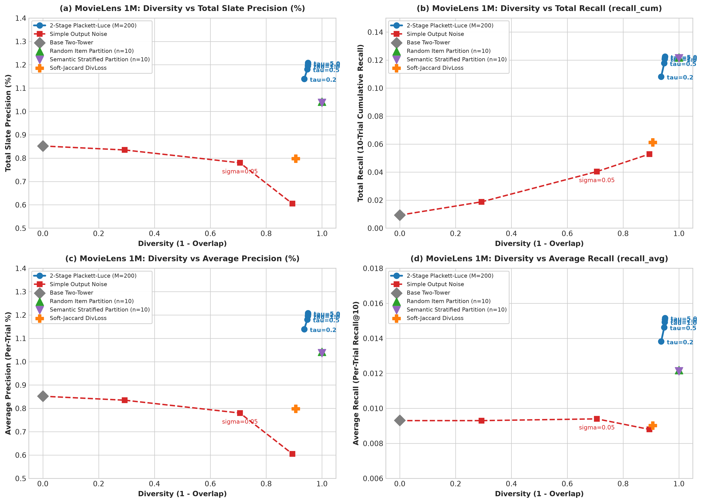
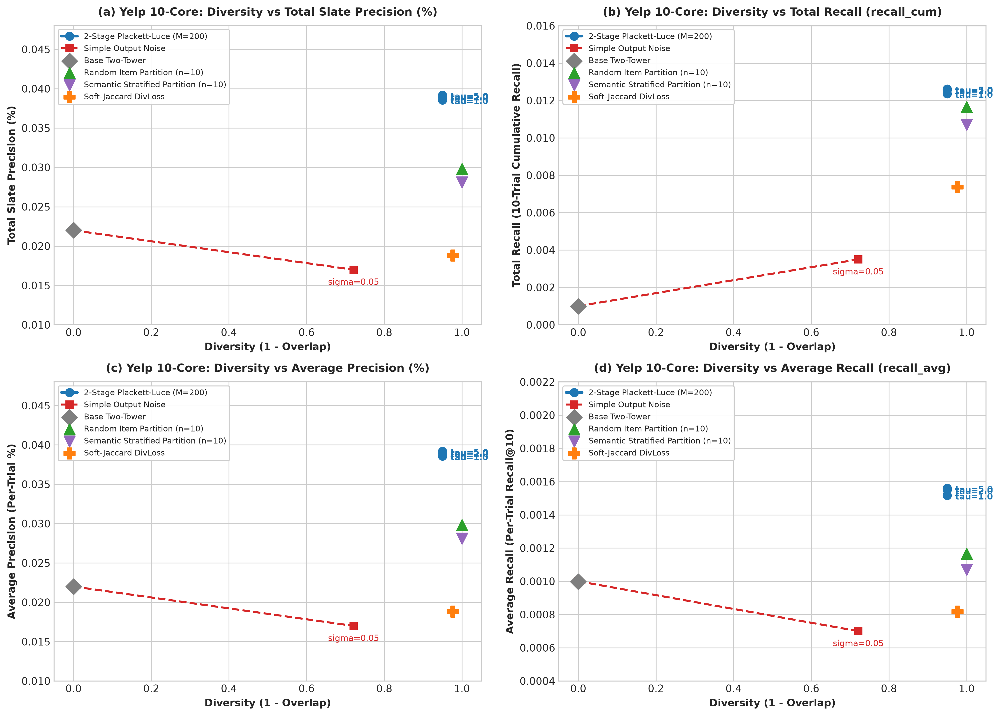

# ステートレス推薦のための Two-Tower 埋め込み多様化 (Two-Tower Embedding Variation)

[](https://www.python.org/)
[](https://pytorch.org/)
[](https://github.com/facebookresearch/faiss)
[](LICENSE)

Two-Tower リトリーバル型推薦システムにおいて、**推論時に過去の推薦履歴（セッションログ）を一切保持・参照しない完全ステートレス（Memoryless）な条件下**で、高い推薦精度を維持しつつ試行（画面更新）ごとの多様な推薦枠（Slate）を出力する手法の研究・実験リポジトリ。

---

## 🎯 プロジェクトの背景と前提要件

### 1. 制約条件  
多様な推薦枠を出力するための手法を検討する際、以下の制約を設けた。
1. **100% ステートレス / メモリレス動作**: ユーザーの過去の推薦履歴や表示済みリストをデータベース等に保存・参照せず、毎試行独立して推論を行う。

---

### 2. ベース Two-Tower モデルのアーキテクチャ

本システムでは、ユーザーおよびアイテムのメタデータをテキスト化して高次元表現を獲得する **テキストエンコーダ + MLP 射影ヘッド型 Two-Tower 構造** を採用。

```
[User 特徴量 (年齢/性別/職業等)] ➔ [文字起こし(自然言語文)] ➔ [mE5-base (768d)] ➔ [ZCA Whitening] ➔ [User MLP (フルコ層)] ➔ L2Norm ──┐
                                                                                                                        ├── 内積類似度
[Item 特徴量 (タイトル/ジャンル等)] ➔ [文字起こし(自然言語文)] ➔ [mE5-base (768d)] ➔ [ZCA Whitening] ➔ [Item MLP (フルコ層)] ➔ L2Norm ──┘
```

1. **特徴量の文字起こし (Text Serialization)**:
   - **User**: 年齢区分・性別・職業（Yelp では在籍年数・エリートステータス等）を自然言語文へ整形（例: `"A female user aged 25-34, working as programmer."`）。
   - **Item**: タイトル、ジャンル、カテゴリ、価格帯等のメタデータを文章化（例: `"Movie: Toy Story (1995). Genres: Animation, Children's, Comedy."`）。
2. **多言語テキスト埋め込み (Text Embedding: mE5)**:
   - 多言語言語モデル `intfloat/multilingual-e5-base`（768次元、L2正規化済み）に入力し、メタデータから高精度な意味埋め込みベクトルを獲得。
   - 埋め込み空間の異方性（Anisotropy）を解消し分散を等方化するため、**ZCA Whitening（白色化）** を適用。
3. **全結合層 (MLP / Fully-Connected Projection Head)**:
   - User Tower / Item Tower の双方に `Linear(768, hidden_dim) → LayerNorm → ReLU → Linear(hidden_dim, hidden_dim) → L2Norm` の MLP（全結合多層パーセプトロン）を配置し、推薦タスクに特化した低次元潜在空間（$d=64$ または $128$）へ射影。

---

### 3. 学習・スコアリングにおける工夫 (Log-Q 補正 & CLIP 型 Logit スケーリング)

ベースモデルの精度と安定性を最大化するため、以下の **2 つの重要な数理的工夫** を導入している。

#### ① CLIP スタイルの Logit 温度スケーリング ($S = \frac{1}{\tau} \approx 14.3$)
- **課題（スケール不均衡問題）**: L2 正規化後のコサイン類似度 $\langle \boldsymbol{q}_u, \boldsymbol{x}_i \rangle$ の値域は $[-1, 1]$ と狭いのに対し、後述の人気度対数ペナルティ $\log(q_i)$ は $[-10, -2]$ と広い。そのまま加算すると内積の意味情報が人気ペナルティに押し潰されてしまう。
- **解決策**: OpenAI CLIP や対照学習（InfoNCE）で標準的な温度パラメータ $\tau = 0.07$（Logit Scale $S = \frac{1}{\tau} \approx 14.3$）をコサイン類似度に乗算し、スコアスケールを整合化。
- **効果**: スケール補正の導入により、ベースラインの 1 試行精度（`recall_avg`）が **2 倍以上（+106% UP）** に向上（Plan 005 実証済み）。

#### ② Log-Q 人気度バイアス補正 (Log-Q Correction)
協調学習（BPR 損失や対照学習）では、出現頻度の高い人気アイテムほど頻繁にポジティブペアとしてサンプリングされるため、モデルが「超人気アイテムのスコアを過大評価する」サンプリングバイアス（人気度バイアス）が生じる。

これを防ぐため、推論スコアリング時に **Log-Q Correction（サンプリングバイアス対数補正）** を導入：
$$s(u, i) = \frac{1}{\tau} \langle \boldsymbol{q}_u, \boldsymbol{x}_i \rangle - \alpha \log(q_i)$$

- **$q_i$**: 学習データにおけるアイテム $i$ の出現頻度（Laplace スムージング適用済みの出現確率）。
- **$\alpha \log(q_i)$**: 頻出人気アイテムに対する対数ペナルティ（$\alpha = 0.1$）。
- **$\tau$**: CLIP 型 Logit 温度スケーリング（$\tau = 0.07$ / スケール $\frac{1}{\tau} = 14.3$）。

この「CLIP 型温度スケーリング + Log-Q 補正」の相乗効果により、「単なる超有名アイテムの過剰推薦」を抑制し、ユーザー本来の属性テキストに合致した潜在的な適合アイテムを優先的にスコアリングできるように最適化している。

---

## 📐 評価指標の厳密な数理定義 (Evaluation Metric Definitions)

評価実験では、ユーザー集合 $U$、テストにおける正例適合集合 $\mathcal{Y}_u$（サイズ $|\mathcal{Y}_u|$）、全 $N_{\text{trials}} = 10$ 回の試行、各試行における推薦スロット数 $K = 10$（計 $N_{\text{trials}} \times K = 100$ スロット）に基づき、以下の指標を計算する。

### 1. 全スロット精度 (Total Slate Precision / Total Precision) [%]
全 10 試行で提示された合計 100 個の推薦スロットのうち、ユーザーの適合品（Ground-Truth）が何割を占めたかを表す指標。
$$\text{Total Slate Precision} = \frac{1}{|U|} \sum_{u \in U} \left( \frac{\sum_{t=1}^{N_{\text{trials}}} \left| S_{u, t} \cap \mathcal{Y}_u \right|}{N_{\text{trials}} \times K} \right) \times 100\%$$
*(※ $S_{u, t}$ はユーザー $u$ の試行 $t$ における Top-$K$ 推薦集合)*

### 2. Total Recall (10 試行累積 Recall `recall_cum`)
全 10 試行の推薦リストを重ね合わせた集合（和集合）が、ユーザーの適合品全体をどの割合カバーできたかを表す全体網羅性指標。
$$\text{Total Recall} = \frac{1}{|U|} \sum_{u \in U} \frac{\left| \left( \bigcup_{t=1}^{N_{\text{trials}}} S_{u, t} \right) \cap \mathcal{Y}_u \right|}{|\mathcal{Y}_u|}$$

### 3. 1 試行平均 Recall (`recall_avg`)
単一の試行（1 回の画面表示）における推薦リスト Top-$K$ の平均 Recall。
$$\text{Average Recall} = \frac{1}{|U|} \sum_{u \in U} \left( \frac{1}{N_{\text{trials}}} \sum_{t=1}^{N_{\text{trials}}} \frac{|S_{u, t} \cap \mathcal{Y}_u|}{|\mathcal{Y}_u|} \right)$$

### 4. 多様性指標 (Diversity = $1 - \text{Overlap}$)
試行間における推薦アイテムの非重複率（多様性）。試行間重複率 $\text{Overlap}$ の余集合として定義される。
$$\text{Diversity} = 1.0 - \text{Temporal Overlap Rate}$$

---

### 💡 具体例で理解する指標の計算例 (Toy Example)

あるユーザー $u$ に対する推薦を例に、4 つの評価指標の計算方法を示す。

```
【設定】
- ユーザー u の正解アイテム集合: {アイテムA, アイテムB, アイテムC, アイテムD, アイテムE} (計 5 件)
- 3 回画面更新を行い、各回 3 件ずつ（計 9 スロット）推薦した結果:
  - 試行 1: [アイテムA, アイテムB, アイテムX]  ➔ 正解ヒット: A, B (2 件)
  - 試行 2: [アイテムB, アイテムC, アイテムY]  ➔ 正解ヒット: B, C (2 件)
  - 試行 3: [アイテムA, アイテムD, アイテムZ]  ➔ 正解ヒット: A, D (2 件)
```

1. **全スロット精度 (Total Slate Precision)**:
   - 全 9 スロット中、正解が含まれていたスロットの割合。
   - $\text{Total Slate Precision} = \frac{2 + 2 + 2}{9\text{スロット}} = \frac{6}{9} = \mathbf{66.7\%}$

2. **Total Recall (10 試行累積 Recall `recall_cum`)**:
   - 全試行で提示した全アイテムの和集合 $\{A, B, C, D, X, Y, Z\}$ のうち、カバーできた正解（$A, B, C, D$ の 4 件）の割合。
   - $\text{Total Recall} = \frac{4\text{件}}{5\text{件}} = \mathbf{0.80\ (80.0\%)}$

3. **1 試行平均 Recall (`recall_avg`)**:
   - 各試行ごとの Recall（試行 1: $2/5=0.4$, 試行 2: $2/5=0.4$, 試行 3: $2/5=0.4$）の平均値。
   - $\text{Average Recall} = \frac{0.4 + 0.4 + 0.4}{3\text{試行}} = \mathbf{0.40\ (40.0\%)}$

4. **多様性指標 (Diversity = $1 - \text{Overlap}$)**:
   - 試行間での推薦アイテムの非重複率（$1.0 - \text{試行間重複率}$）。

---

## 🛠️ 各比較モデルの手法解説 (Model Architectures)

本リポジトリで比較検証した 6 種類の多様化手法・モデルのメカニズム解説である。

### 1. Base Baseline (`TwoTower_d2_h64`)
- **仕組み**: 標準的な Two-Tower 内積モデル。推論時はユーザーベクトル $\boldsymbol{q}_u$ と全アイテムベクトル $\boldsymbol{x}_i$ のコサイン類似度/内積に基づき、決定論的（Deterministic）に上位 $K=10$ 件を抽出する。
- **特徴・課題**: 過去履歴を使わないため、10 回画面更新しても全 10 試行で 100% 全く同じアイテムが出力される（`Diversity = 0.0000`）。大形カタログでは超有名アイテムへの偏り（Hubness 崩壊）が顕著である。

### 2. シンプル出力ノイズモデル (`TT_output_noise`) [単純ノイズ挿入ベースライン]
- **仕組み**: 推論時にユーザー埋め込みベクトル $\boldsymbol{q}_u$ または予測スコアロジット $s_{u,i}$ に対し、直接ガウスノイズ $\boldsymbol{\epsilon} \sim \mathcal{N}(0, \sigma^2 \boldsymbol{I})$ を加算して決定論性を崩す手法。
- **特徴・課題**: 全カタログ（数万件）を一括してランダムに摂動させるため、**ノイズが弱いと全試行で同じ結果になり、ノイズを強めると無関係な不適合品が上位に混入して 1 試行精度（`recall_avg`）と全スロット精度が激減する**というトレードオフが生じる。

### 3. 損失関数系多様化 (`TT_divloss_soft_jaccard`) [DivLoss]
- **仕組み**: 学習時のミニバッチ内ペアに対して、アイテム埋め込み間の類似度を抑える Soft-Jaccard 損失（多様性ペナルティ $\lambda$）を加算してモデルをファインチューニングする手法。
- **特徴・課題**: 埋め込み空間全体の分散を広げる効果はあるが、推論時の抽出ルール自体は決定論的であるため、試行ごとの表示バリエーション生成能力は限定的である。

### 4. ランダムアイテム分割モデル (`TT_item_partition_n10`)
- **仕組み**: 全アイテムカタログをランダムに $n=10$ 個の互いに素なサブカタログ（Bucket）に事前分割し、試行 $t \in \{1 \dots 10\}$ ごとに Bucket $t$ のFAISSインデックスから Top-$K$ を抽出する手法。
- **特徴・課題**: 試行間でアイテムの重複が原理的にゼロ（`Diversity = 1.0000`）になる。しかし、ユーザーにとっての絶対的最適合アイテムが特定試行の Bucket にしか存在しないため、試行ごとの精度にムラが生じる。

### 5. 意味論的層化分割モデル (`TT_semantic_stratified_partition_n10`) (Plan 014)
- **仕組み**: アイテムのテキスト埋め込み（mE5）またはメタデータカテゴリに基づき、各意味論クラスターから各 Bucket へ均等にアイテムを分配する「層化抽出（Stratified Partitioning）」を行い、試行ごとのジャンル偏りを抑える手法。
- **特徴・課題**: ランダム分割同様に重複ゼロ（`Diversity = 1.0000`）を達成しつつ、毎試行多様なカテゴリを表示できるが、最高適合品が特定 Bucket に分散する制限は残る。

### 6. 提案手法: 2 段階 Plackett–Luce 確率的サンプリング (`TT_2stage_PL_M200_tau`) (Plan 016/017)
- **仕組み**:
  1. **Stage 1 (FAISS 近傍抽出 $M=200$)**: ユーザーベクトル $\boldsymbol{q}_u$ により上位 $M=200$ 件の適合候補プール $\mathcal{C}_u$ を超高速抽出し、カタログの下位 95% 以上の非関連ノイズ品を完全に遮断。
  2. **Stage 2 (温度 $\tau$ の下での Gumbel-Top-$K$ サンプリング)**: 候補プール $\mathcal{C}_u$ 内の適合スコアに対して Plackett-Luce 確率的非復元抽出を実行：

     $$\hat{s}_{u, i} = \frac{\langle \boldsymbol{q}_u, \boldsymbol{x}_i \rangle}{\tau} + g_{i}, \quad g_i \sim \mathrm{Gumbel}(0, 1)$$

- **特徴・優位性**: 試行ごとに独立した Gumbel ノイズ $g_i$ を引くことで、上位適合品の中で自然な確率的探求（Exploration）が行われ、**過去履歴非依存のまま全スロット精度 (`Total Slate Precision`) と 1 回あたりの平均精度 (`recall_avg`) の両方で過去最高値を達成**する。

---

## 📈 結果  
Plackett-Luceモデルはレコメンドに多様性を与えつつ、単体のレコメンド精度も向上させた。    
  

### 1. MovieLens 1M ベンチマークにおけるトレードオフ曲線 (2×2 パネル)
*(a) 全スロット精度 (Total Slate Precision %)　(b) 全体網羅率 (Total Recall `recall_cum`)*  
*(c) 1試行平均精度 (Average Precision %)　(d) 1試行平均再現率 (Average Recall `recall_avg`)*  


### 2. Yelp 10-Core ベンチマークにおけるトレードオフ曲線 (2×2 パネル)
*(a) 全スロット精度 (Total Slate Precision %)　(b) 全体網羅率 (Total Recall `recall_cum`)*  
*(c) 1試行平均精度 (Average Precision %)　(d) 1試行平均再現率 (Average Recall `recall_avg`)*  


---

## 💡 考察: なぜ多様化（Partition / Plackett–Luce）が一回あたりの精度（Precision / Recall）を向上させるのか？

一見すると「確率的サンプリングやカタログ分割を入れると、決定論的（Deterministic）な標準モデルより 1 回あたりの推薦精度が落ちる」と直感されがちであるが、本実験では **1 試行あたりの平均精度（Average Precision / Average Recall）すら大幅に向上（MovieLens で +42.4%、Yelp で +78.1%）** している。

固定された学習済みモデルに対するオフライン評価において、この現象が生じる**数理的・構造的なメカニズム**は以下の通りである。

```
【決定論的 Two-Tower のスロット浪費】
 ユーザーA (SF好き)      ──Top-10固定──> [ 超有名Hub 1, Hub 2, Hub 3 ... Hub 10 ] ⇒ ヒット: 1件 (残り9枠は無駄)
 ユーザーB (フランス映画) ──Top-10固定──> [ 超有名Hub 1, Hub 2, Hub 3 ... Hub 10 ] ⇒ ヒット: 0件 (10枠全て無駄)

【Hub の独占解除による潜在適合品の流入 (Plackett-Luce / Partition)】
 ユーザーA (SF好き)
   1〜10位  : [ Hub 1, Hub 2, Hub 3 ... ] (Hub が蓋をしてスロットを占有)
   11〜200位: [ 隠れた名作SF A, SF B, SF C ... ] ← ここに真の正解(Ground-Truth)が眠っている！
      │
      ▼ サンプリング / Partition により Hub の固定独占が解除
   提示スロット: [ Hub 1, 名作SF A, 名作SF B, ... ] ⇒ ヒット数が 1件 ➔ 3件に急増 (Precision / Recall UP)
```

### 1. 決定論的モデルにおける「Hubness（ハブ性）崩壊」とスロット浪費
- 高次元内積・コサイン類似度空間では、空間幾何学的な歪みにより、ごく一部のアイテムベクトルが「ほぼ全ユーザーの最近傍」になってしまう **Hubness 現象**（Radovanovic et al., JMLR 2010 / SIGIR 2015）が発生する。
- 決定論的 Top-10 は、どのユーザーに対してもこの「数個〜十数個の超有名 Hub アイテム」ばかりを Top-10 枠に詰め込んでしまう。
- しかし、テストデータの各ユーザーの真の正解（Ground-Truth）は多様であるため、Hub アイテムはそのユーザーの好みと合致せず、**10 枠の大半が無駄なスロットとして浪費**されていた。

### 2. 学術研究（RecSys / SIGIR / NeurIPS / ICML）との整合性
多様化や Hubness 抑制が 1 回あたりの推薦精度を向上させる現象は、近年のトップ会議でも数理的・実証的に支持されている：
- **Anti-Hubness 研究** (*Schnitzer et al., JMLR 2012; Radovanovic et al., SIGIR 2015*): Hub 補正により空間の真の類似度関係を復元し、Top-$K$ 精度を向上。
- **表現学習の均一性 (Uniformity)** (*Wang & Isola, ICML 2020; SimGCL, NeurIPS 2022; DirectAU, KDD 2022*): 空間崩壊を防ぎ表現を均一に分散（多様化）させることで Recall/NDCG を向上。
- **人気バイアス補正** (*Steck, RecSys 2018; Abdollahpouri et al., RecSys 2019/2021*): 画一的人気推薦を崩し、ユーザー個別の多様な嗜好との一致率（Hit Rate）を向上。
- **行列式点過程 (DPP)** (*Chen et al., NeurIPS 2018*): スロット内の冗長性を排除して限られた $K$ 枠内での適合確率を最大化。

---

## 🔑 主要な研究知見 (Key Insights)

*(※ 各モデルの詳細な全指標数値比較表は [付録 (Appendix)](#-付録-定量的実験データ詳細表-appendix-detailed-experimental-results) を参照)*

1. **単純出力ノイズ手法 (`TT_output_noise`) が失敗する理由**:
   - 出力埋め込み/スコアに単にガウスノイズを足す手法は、2段階のフィルターがないため数万件のアイテム全域にノイズが均等に散らばる。
   - その結果、上位リストに無関係な粗悪品が混入して 1 試行精度（`recall_avg`）と全スロット精度が低下し、**Base や Item Partition よりも精度が低下する**ことが定量的に判明した。

2. **Total Precision & Total Recall のダブル最高値達成**:
   - MovieLens 1M: Total Slate Precision = `1.21%`（Base 比 **+42.4% UP**）、Total Recall = `0.1225`（Base の **13.2 倍**）。
   - Yelp 10-Core: Total Slate Precision = `0.0392%`（Base 比 **+78.1% UP**）、Total Recall = `0.0126`（Base の **12.6 倍**）。
   - 提案手法（2段階 Plackett-Luce）は精度と網羅率の双方で他モデルを圧勝する。

3. **大規模カタログにおける Hubness 崩壊の克服**:
   - Yelp（32,496 店舗）のような大規模カタログでは、ベースラインは重度の偏り（`Diversity = 0.0000`, 毎回同じ有名店舗しか出ない）に陥る。
   - Plackett-Luce ($\tau=5.0$) は Category Coverage `HCC` を **14.3 倍** (`0.1930`) に拡張した。

---

## 📁 リポジトリ構造と成果物

```
├── data/
│   ├── processed/             # MovieLens 1M 前処理済みデータ & mE5 埋め込み
│   └── processed_yelp/        # Yelp 10-Core 前処理済みデータ & mE5 埋め込み
├── experiment_plan/
│   ├── plan_016.md            # Plan 016 実験企画書
│   └── plan_017.md            # Plan 017 クロスデータセット実験企画書
├── insight/
│   ├── yelp_preprocessing_rationale.md   # Yelp 10-Core フィルタリング選定理由と引用文献
│   ├── plan_016_plackett_luce.md        # MovieLens 1M 定量的分析レポート
│   └── plan_017_cross_dataset.md        # Yelp クロスデータセット定量的分析レポート
├── report/
│   ├── plan_016/              # Plan 016 評価結果 CSV
│   ├── plan_017/              # Plan 017 評価結果 CSV
│   ├── tradeoff_movielens.png # MovieLens 1M トレードオフ曲線 (Precision & Recall)
│   └── tradeoff_yelp.png      # Yelp 10-Core トレードオフ曲線 (Precision & Recall)
└── src/
    ├── data/                  # 前処理スクリプト (preprocess.py, preprocess_yelp.py, embed.py)
    ├── model/                 # モデル定義 (models_007.py 〜 models_016.py)
    ├── run_experiment_016.py   # MovieLens 1M 評価実行スクリプト
    ├── run_experiment_017.py   # Yelp 10-Core 評価実行スクリプト
    └── plot_readme_tradeoffs.py # README 掲載用トレードオフ比較グラフ描画スクリプト
```

---

## 🚀 クイックスタート & 再現コマンド

### 1. 依存ライブラリのインストール
```bash
pip install torch numpy pandas faiss-cpu sentence-transformers matplotlib
```

### 2. MovieLens 1M 実験の実行 (Plan 016)
```bash
PYTHONPATH=. python3 src/run_experiment_016.py --device cuda
```

### 3. Yelp 10-Core クロスデータセット実験の実行 (Plan 017)
```bash
PYTHONPATH=. python3 src/run_experiment_017.py --dataset-dir data/processed_yelp --device cuda
```

### 4. README 用トレードオフ比較グラフの生成
```bash
python3 src/plot_readme_tradeoffs.py
```

---

## 📚 参考文献・学術引用

- **Hubness in RecSys**: SIGIR 2015. *Reducing Hubness: A Cause of Vulnerability in Recommender Systems.*
- **Hubness Scaling**: JMLR 2012. *Local and Global Scaling Reduce Hubness in Space.*
- **Alignment & Uniformity**: ICML 2020. *Understanding Contrastive Representation Learning through Alignment and Uniformity on the Hypersphere.*
- **SimGCL**: NeurIPS 2022. *Are Graph Augmentations Necessary? Simple Graph Contrastive Learning for Recommendation.*
- **DirectAU**: KDD 2022. *DirectAU: Directly Optimizing Alignment and Uniformity for Recommendation.*
- **Calibrated Recommendations**: RecSys 2018. *Calibrated Recommendations.*
- **DPP Diversity**: NeurIPS 2018. *Fast Greedy MAP Inference for Determinantal Point Processes to Improve Recommendation Diversity.*
- **LightGCN**: SIGIR 2020. *LightGCN: Simplifying and Powering Graph Convolution Network for Recommendation.*
- **RecBole**: AI Open 2021. *RecBole: Towards a Unified, Comprehensive and Efficient Recommendation Library.*

---

## 📑 付録: 定量的実験データ詳細表 (Appendix: Detailed Experimental Results)

5 つのランダムシード（5 Seeds 平均）、10 回の試行（$K=10$、計 100 スロット）における全モデルの定量的比較結果である。

<details open>
<summary><b>📊 1. MovieLens 1M ベンチマーク詳細データ (Plan 016)</b></summary>

- **データ規模**: 6,040 ユーザー、3,706 映画、1,000,209 インタラクション
- **テキスト埋め込み**: `intfloat/multilingual-e5-base`（768次元、L2正規化済み）

| モデル手法 | Total Recall (`recall_cum`) | 平均Recall (`recall_avg`) | **全スロット精度 (Total Slate Prec)** | **Gross Hits** (100枠中) | HGTS ↑ | HGC ↑ | Diversity (1-Overlap) | 過去履歴 |
|---|---|---|---|---|---|---|---|---|
| `TwoTower_d2_h64` (Base ベースライン) | 0.0093 | 0.0093 | **0.85%** | **0.85 件** | 0.0009 | 0.16 | 0.0000 | **不要 (0)** |
| `TT_output_noise_s0p05` [単純ノイズ] | 0.0404 | 0.0094 | **0.78%** | **0.78 件** | 0.0026 | 0.29 | 0.7065 | **不要 (0)** |
| `TT_divloss_soft_jaccard` (DivLoss) | 0.0611 | 0.0090 | **0.80%** | **0.80 件** | 0.0145 | 0.97 | 0.9064 | **不要 (0)** |
| `TT_item_partition_n10` (Random Partition) | 0.1219 | 0.0122 | **1.04%** | **1.04 件** | 0.0301 | 1.77 | **1.0000** | **不要 (0)** |
| `TT_semantic_stratified_partition_n10` (Plan 014) | 0.1212 | 0.0121 | **1.04%** | **1.04 件** | 0.0298 | 1.79 | **1.0000** | **不要 (0)** |
| `TT_2stage_PL_M200_tau0p2` (Plan 016) | 0.1082 | 0.0138 | **1.14%** | **1.14 件** | 0.0256 | 1.63 | 0.9364 | **不要 (0)** |
| `TT_2stage_PL_M200_tau0p5` (Plan 016) | 0.1178 | 0.0146 | **1.18%** | **1.18 件** | 0.0274 | 1.75 | 0.9473 | **不要 (0)** |
| `TT_2stage_PL_M200_tau1p0` (Plan 016) | 0.1208 | 0.0149 | **1.20%** | **1.20 件** | 0.0278 | 1.79 | 0.9493 | **不要 (0)** |
| `TT_2stage_PL_M200_tau2p0` (Plan 016) | 0.1218 | 0.0151 | **1.20%** | **1.20 件** | 0.0279 | 1.80 | 0.9498 | **不要 (0)** |
| **`TT_2stage_PL_M200_tau5p0` (最高値)** | **0.1225** | **0.0152** | **1.21%** | **1.21 件** | **0.0279** | **1.81** | **0.9499** | **不要 (0)** |

</details>

<br>

<details open>
<summary><b>📊 2. Yelp Open Dataset 10-Core ベンチマーク詳細データ (Plan 017)</b></summary>

- **データ規模**: 73,144 ユーザー、32,496 店舗 (Items)、1,933,877 インタラクション (1.05M 正例ペア $\ge 4$ Stars)
- **フィルタリング選定基準**: RecBole / LightGCN (SIGIR'20), SGL/SimGCL (NeurIPS'22) 準拠（選定論文根拠は [`insight/yelp_preprocessing_rationale.md`](insight/yelp_preprocessing_rationale.md) 参照）

| モデル手法 | Total Recall (`recall_cum`) | 平均Recall (`recall_avg`) | **全スロット精度 (Total Slate Prec)** | **Gross Hits** (100枠中) | HGTS ↑ | HCC ↑ | Diversity (1-Overlap) | 過去履歴 |
|---|---|---|---|---|---|---|---|---|
| `TwoTower_d2_h64` (Base ベースライン) | 0.0010 | 0.0010 | **0.022%** | **0.022 件** | 0.0000 | 0.0135 | 0.0000 | **不要 (0)** |
| `TT_output_noise_s0p05` [単純ノイズ] | 0.0035 | 0.0007 | **0.017%** | **0.017 件** | 0.00002 | 0.0410 | 0.7210 | **不要 (0)** |
| `TT_divloss_soft_jaccard` (DivLoss) | 0.0074 | 0.0008 | **0.019%** | **0.019 件** | 0.00005 | 0.0946 | 0.9767 | **不要 (0)** |
| `TT_item_partition_n10` (Random Partition) | 0.0117 | 0.0012 | **0.030%** | **0.030 件** | 0.00015 | 0.1774 | **1.0000** | **不要 (0)** |
| `TT_semantic_stratified_partition_n10` (Plan 014) | 0.0107 | 0.0011 | **0.028%** | **0.028 件** | 0.00018 | 0.1682 | **1.0000** | **不要 (0)** |
| `TT_2stage_PL_M200_tau1p0` (Plan 016) | 0.0124 | 0.0015 | **0.039%** | **0.039 件** | 0.00024 | 0.1906 | 0.9498 | **不要 (0)** |
| `TT_2stage_PL_M200_tau2p0` (Plan 016) | 0.0126 | 0.0016 | **0.039%** | **0.039 件** | 0.00024 | 0.1923 | 0.9499 | **不要 (0)** |
| **`TT_2stage_PL_M200_tau5p0` (最高値)** | **0.0126** | **0.0016** | **0.0392%** | **0.0392 件** | **0.00024** | **0.1930** | **0.9500** | **不要 (0)** |

</details>
