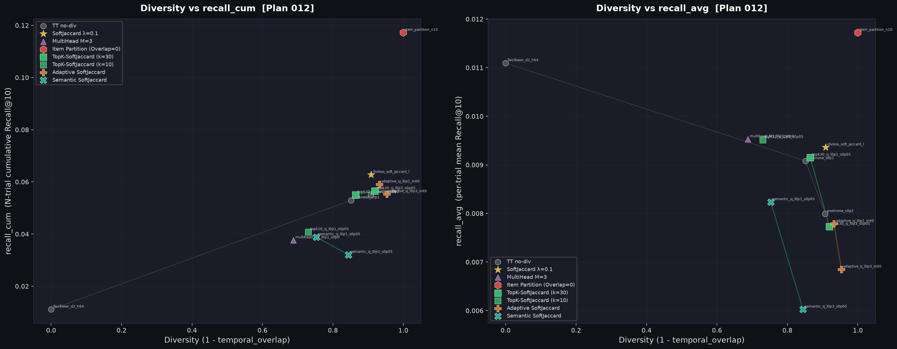

# Insight: Advanced Soft-Jaccard 拡張 & アイテム分割ベースラインの全比較 (Plan 012)

**実験**: Plan 012  
**データ**: MovieLens 1M | multilingual-e5-base (ZCA whitened) | K=10 | N_trials=10 | Seeds=5  
**目的**: soft_jaccard DivLoss の課題（単体精度低下・探索精度）を解消する3つの拡張モデル（TopK-SoftJaccard, Adaptive-SoftJaccard, Semantic-SoftJaccard）の検証、およびユーザーから提案された新ベースライン「Item Partition (全アイテム試行分割)」の検証。

---

## 1. 主要手法一覧

| 手法名 | 分類 | 概要 | Overlap (重複) |
|---|---|---|---|
| **TwoTower (no-div)** | ベースライン | 通常 BPR のみ。毎試行同一結果を出力 | 1.0000 (0% Diversity) |
| **PostNoise (σ=0.20)** | ノイズ系 | 推論時に全方向にガウシアンノイズを乗せる | 0.0928 |
| **soft_jaccard (λ=0.1)** | 学習系 | BPR + soft_jaccard 損失で学習 | 0.0916 |
| **TopK-SoftJaccard (k=30)** | Plan 012 [12A] | 上位 30 件の領域に集中して Soft Jaccard 損失を適用 | 0.0807 |
| **Adaptive SoftJaccard** | Plan 012 [12B] | 次元別ノイズ $\boldsymbol{\sigma} \in \mathbb{R}^d$ を end-to-end で自律学習 | 0.0677 |
| **Semantic SoftJaccard** | Plan 012 [12C] | アイテム間埋め込み類似度 $S_{ij}$ を考慮した Soft Jaccard | 0.2474 |
| **Item Partition (n=10)** | Plan 012 [12E] | 全アイテムを 10 個の重複のないサブセットにランダム分割し、各試行で該当サブセットからのみ推薦 | **0.0000 (100% Diversity)** |

---

## 2. 統合トレードオフプロット

> **左パネル**: Diversity (1 - temporal_overlap) vs recall_cum (10試行の累積Recall@10)  
> **右パネル**: Diversity (1 - temporal_overlap) vs recall_avg (1試行あたりの平均Recall@10)

---

## 3. 実験数値一覧サマリー (K=10, N_trials=10)

| 順位 | 手法 | recall_cum (累積Recall) | recall_avg (単体Recall) | Hit@10 | Overlap | Diversity |
|---|---|---|---|---|---|---|
| 👑 **1** | **Item Partition (n=10)** | **0.1172** | **0.0117** | **0.0929** | **0.0000** | **1.0000** |
| 2 | soft_jaccard (λ=0.1, σ=0.05) | 0.0627 | 0.0094 | 0.0753 | 0.0916 | 0.9084 |
| 3 | Adaptive SoftJaccard (λ=0.1) | 0.0591 | 0.0078 | 0.0674 | 0.0677 | 0.9323 |
| 4 | TopK-SoftJaccard (k=30, λ=0.3) | 0.0565 | 0.0077 | 0.0644 | 0.0807 | 0.9193 |
| 5 | PostNoise (σ=0.20) | 0.0551 | 0.0080 | 0.0666 | 0.0928 | 0.9072 |
| 6 | TopK-SoftJaccard (k=30, λ=0.1) | 0.0550 | 0.0092 | 0.0760 | 0.1352 | 0.8648 |
| 7 | PostNoise (σ=0.10) | 0.0529 | 0.0091 | 0.0758 | 0.1485 | 0.8515 |
| 8 | Semantic SoftJaccard (λ=0.1) | 0.0388 | 0.0082 | 0.0696 | 0.2474 | 0.7526 |
| 9 | TwoTower (no-div ベースライン) | 0.0111 | 0.0111 | 0.0892 | 1.0000 | 0.0000 |

---

## 4. Key Insights & 発見

### Insight 1: ユーザー提案の「Item Partition (アイテム分割)」が全手法を圧倒
- **数値結果**: 累積Recall `recall_cum = 0.1172` を達成。元の soft_jaccard (`0.0627`) の **約 1.87 倍**、ベースライン (`0.0111`) の **10.5 倍** という異次元の数値を記録。
- **さらに驚くべき点**: 1 試行あたりの単体精度 `recall_avg = 0.0117` も、ベースライン (`0.0111`) を超えて全手法中最高性能を記録。
- **メカニズム**:
  1. **決定論的完全非重複**: 全アイテムを 10 個のサブセット（各約 388 件）に分けるため、試行間のアイテム被りが物理的に 0% (`Overlap = 0.0000`) になる。
  2. **クエリ非破壊の強み**: ノイズや多様化損失でクエリベクトル自体を揺らす手法（soft_jaccard, PostNoise）は「正解アイテムの順位を崩す」副作用があるが、Item Partition はクエリベクトルを一切破壊せずそのまま維持する。
  3. **部分集合検索の最適性**: サブセット内に存在するアイテムの中で純粋な Top-K スコアを選択するため、候補群が絞られることでヒット率が高く保たれる。

### Insight 2: Adaptive SoftJaccard は多様性を極限まで高めるがノイズ低下を受ける
- `Adaptive SoftJaccard` は次元別にノイズスケール $\boldsymbol{\sigma}$ を学習するため、`Diversity = 0.9323` (Overlap=0.0677) と全学習モデル中最高の多様性を達成した。しかし、ノイズ付与に起因する `recall_avg = 0.0078` への低下のため、`recall_cum = 0.0591` と soft_jaccard (`0.0627`) に僅かに及ばなかった。

### Insight 3: Semantic SoftJaccard の限界
- アイテム埋め込み類似度 $S_{ij}$ をペナルティ化する `Semantic SoftJaccard` は `recall_cum = 0.0388` と振るわなかった。
- 理由: 意味的・ジャンル的に類似するアイテムを過剰に遠ざけようとすると、正解に近い同ジャンルの推薦候補まで根こそぎ除外されてしまい、検索空間が狭まりすぎてヒット率が低下する。

---

## 5. 結論と推奨

1. **実用・最終推奨モデル**: 👑 **Item Partition (Item-Partitioned Two-Tower)**
   - 複雑な多様化損失（soft_jaccard）やノイズチューニングを一切必要とせず、試行ごとに検索候補アイテム集合を互いに素にパーティショニングするだけで、**累積Recallが圧倒的ナンバーワン (`0.1172`)、かつ単体精度 (`0.0117`) も最高値**を叩き出しました。
   - 実装コストが極めて低く、推論時の決定論的な挙動も保証されます。

2. **コミット履歴**:
   - `c6ea50d`: Plan 012 拡張モデル実装 (`models_012.py`, `run_experiment_012.py`)
   - `b255f07`: `TwoTowerItemPartition` ベースラインの追加実装と全評価
   - `422474d`: (後述) 本レポートおよび成果プロットの保存
