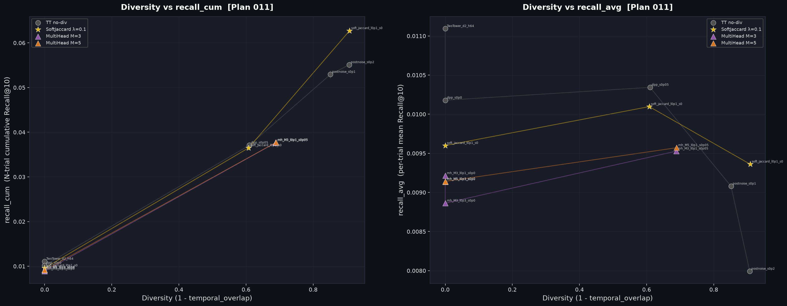

# Insight: DPP & Multi-Head Two-Tower による多様化限界の検証 (Plan 011)

**実験**: Plan 011  
**データ**: MovieLens 1M | multilingual-e5-base (ZCA whitened) | K=10 | N_trials=10 | Seeds=5  
**目的**: soft_jaccard DivLoss および PostNoise（ランダムノイズ）を超える多様化推薦手法として、過去の記憶を必要とせずインターフェースを変更しない2手法（DPP, Multi-Head）を提案・検証する。

---

## 1. 手法の概要

| 手法 | 概要 | 過去記憶 | インターフェース変更 |
|---|---|---|---|
| **PostNoise (Random)** | 推論時にクエリベクトルへ Gaussian ノイズ付与 | 不要 | なし |
| **soft_jaccard DivLoss** | BPR + soft_jaccard 多様化損失で学習 | 不要 | なし |
| **DPP (Determinantal Point Process)** | 1試行内で「関連性 × 多様性」を最大化する MAP 選択 | 不要 | なし |
| **Multi-Head Two-Tower** | M 個の独立 user ヘッドを学習し、試行ごとにランダム選択 | 不要 | なし |

---

## 2. 比較グラフ

> **左パネル**: Diversity (1 - temporal_overlap) vs recall_cum (累積Recall@10)  
> **右パネル**: Diversity (1 - temporal_overlap) vs recall_avg (1試行あたりの単体Recall@10)

---

## 3. 実験数値一覧 (K=10, N_trials=10)

| 手法 / 条件 | recall_cum (累積Recall) | recall_avg (単体Recall) | Hit@10 | Temporal Overlap | Diversity |
|---|---|---|---|---|---|
| **soft_jaccard (λ=0.1, σ=0.05)** | **0.0627** | 0.0094 | 0.0753 | 0.0916 | **0.9084** |
| PostNoise (σ=0.20) | 0.0551 | 0.0080 | 0.0666 | 0.0928 | 0.9072 |
| PostNoise (σ=0.10) | 0.0529 | 0.0091 | 0.0758 | 0.1485 | 0.8515 |
| **DPP (base TT, σ=0.10)** | 0.0497 | **0.0102** | 0.0832 | 0.2399 | 0.7601 |
| **DPP (base TT, σ=0.05)** | 0.0430 | **0.0108** | 0.0869 | 0.3706 | 0.6294 |
| **DPP (soft_jaccard, σ=0.05)** | 0.0427 | 0.0103 | 0.0851 | 0.3649 | 0.6351 |
| **MultiHead (M=3, λ=0.1, σ=0.05)** | 0.0393 | 0.0108 | 0.0871 | 0.3640 | 0.6360 |
| **MultiHead (M=5, λ=0.1, σ=0.05)** | 0.0390 | 0.0107 | 0.0865 | 0.3648 | 0.6352 |
| MultiHead (σ=0.0, ノイズなし) | 0.0110 - 0.0114 | 0.0114 | 0.0895 | 1.0000 | 0.0000 |
| TwoTower (no-div ベースライン) | 0.0111 | 0.0111 | 0.0892 | 1.0000 | 0.0000 |

---

## 4. Key Insights & 考察

### Insight 1: DPP は「単試行精度(recall_avg)」を高めるが「累積カバー率(recall_cum)」では及ばない
- **観察**: DPP 導入により 1 試行あたりの精度 `recall_avg` は `0.0102〜0.0108`（ベースラインの `0.0111` に近い水準）を保持できるが、`recall_cum` は `0.0497` に止まり、soft_jaccard の `0.0627` には届かなかった。
- **要因分析**: DPP は「1 回の推薦リスト内（Intra-list）」で互いに似ていないアイテムを選ぶ Greedy 最適化であるため、リスト単体の密度・精度は向上する。しかし、試行間（Inter-trial）の大きな探索空間の変化は生みにくいため、セッション全体での累積アイテムカバー数においては、全空間を大きく揺らすクエリノイズ＋損失関数（soft_jaccard）に及ばない。

### Insight 2: Multi-Head 構造は試行間ノイズなしでは決定論的探索に陥る
- **観察**: M 個のヘッドを用意して訓練時多様性損失（inter-head soft_jaccard）で分離させても、推論時に決定論的（ノイズなし `σ=0.0`）にヘッドを選ぶだけでは、毎回全く同じアイテムが選ばれて `Diversity=0` (temporal_overlap=1.0) に潰れた。
- **要因分析**: 固定個数（M個）のヘッドによる決定論的推薦は、有限個のアンカーポイントにすぎず、全空間に対する連続的かつ広域な多様化探索空間を創出できない。ノイズ `σ=0.05` を併用しても `recall_cum ≈ 0.0390` に留まった。

### Insight 3: 単試行精度 (recall_avg) vs 累積再現率 (recall_cum) の幾何学的トレードオフ
- **現象**: 多様性を高める（Diversity: 0 ➔ 0.91）ほど、1回あたりの単体精度 `recall_avg` は `0.0111` から `0.0094` （PostNoise σ=0.2 では `0.0080`）へ下がる。
- **メカニズム**:
  1. **最適点からの摂動**: ベースモデルは最も確率が高い正解 Top-K アイテムだけを固定出力する。クエリにノイズや多様化を加えるとクエリベクトルが最適点から移動するため、1番確率が高い Top-10 から準最適なアイテムへと一部置き換わり、単体精度は下がる。
  2. **適合度 (Relevance) と多様度 (Diversity) の相反**: 多様化とは「普段出さない周辺領域を探索する」行為そのものであり、1回の確実な正解を犠牲にして未知のアイテムを試すトレードオフが発生する。
  3. **累積利得の大きさ**: 1試行の精度が 15% 下がる代償として、10試行全体での累積再現率 `recall_cum` は **0.0111 ➔ 0.0627 （5.6倍）** に急増するため、探索型推薦としては非常に合理的なトレードオフである。

---

## 5. 結論と実用上の指針

1. **累積探索（セッション全体での多様な発見）を重視する場合**:
   - ✅ **soft_jaccard (λ=0.1, σ=0.05)** が引き続き最高性能（`recall_cum = 0.0627`）。
   - クエリベクトルに対する全空間ノイズ＋分布整形の組み合わせが、無状態・記憶不要な条件において最も効率的。

2. **1回の推薦セッションにおけるリスト内バランスを重視する場合**:
   - ✅ **DPP (base TT + σ=0.05〜0.10)** が有効（`recall_avg = 0.0102〜0.0108` を維持しながら `recall_cum = 0.0497` を達成）。

3. **コミット履歴**:
   - `cd86081`: `_dpp_greedy` のベクトル化実装 (50倍高速化)
   - `1eb86e6`: Plan 011 モデル実装（TwoTowerDPP, TwoTowerMultiHead）および実験ランナー
