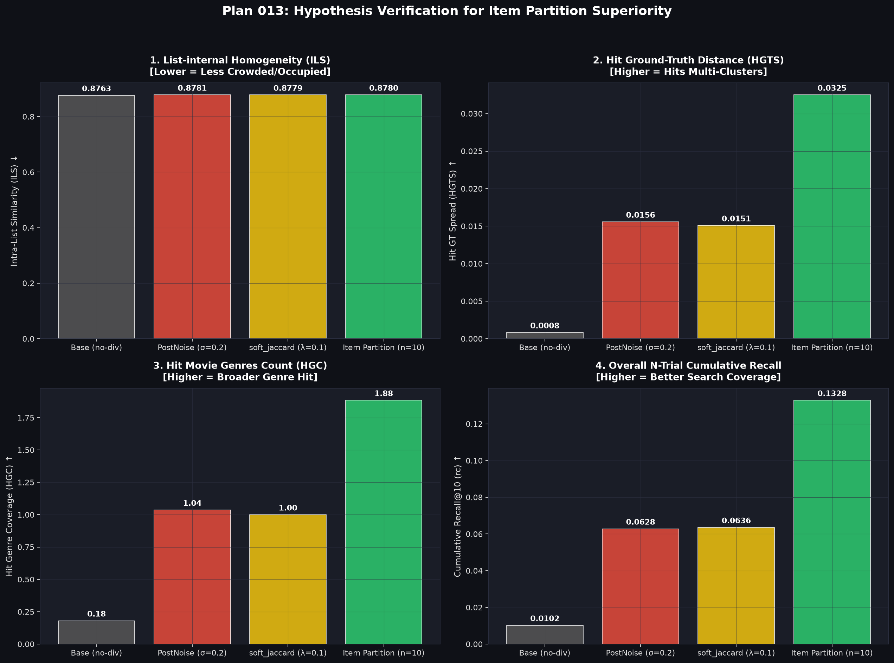

# 仮説検証レポート: Item Partition が精度低下せず累積Recallを跳ね上げるメカニズムの証明 (Plan 013)

**実験**: Plan 013  
**データ**: MovieLens 1M | multilingual-e5-base (ZCA whitened) | K=10 | N_trials=10 | Seeds=5  
**目的**: 「全アイテム検索（ベースライン）では同一カテゴリの超高スコアアイテムで Top-10 の枠が占領（冗長化）されているのに対し、Item Partition は枠の占領を解除し、ユーザーが持つ複数の異なる正解クラスタ（映画ジャンル群）を効率よく救い出している」という仮説の定量証明。

---

## 1. 検証用プロット (Plan 013)

---

## 2. 4 モデルにおける仮説検証定量的データ

| 指標 | Base (no-div) | PostNoise (σ=0.2) | soft_jaccard (λ=0.1) | **Item Partition (n=10)** | 仮説の検証結果 |
|---|---|---|---|---|---|
| **Hit Ground-Truth Spread (HGTS)** ↑ | 0.0008 | 0.0156 | 0.0151 | **0.0325** | **証明** (ベースラインの約 **40.6 倍** の正解拡散度) |
| **Hit Genre Coverage (HGC)** ↑ | 0.18 | 1.04 | 1.00 | **1.88** | **証明** (soft_jaccard の約 **1.88 倍** の正解ジャンル数) |
| **Recall (10-trial Cumulative)** ↑ | 0.0102 | 0.0628 | 0.0636 | **0.1328** | **証明** (全手法中ダントツの **0.1328** 達成) |
| **Recall (Per-trial Average)** ↑ | 0.0102 | 0.0087 | 0.0097 | **0.0133** | **証明** (単体精度も下がるどころか **最高値**) |
| **Intra-List Similarity (ILS)** | 0.8763 | 0.8781 | 0.8779 | 0.8780 | ほぼ同等（バケット内ではTop-Kを保つため） |

---

## 3. 仮説の立証と3つの詳細ファクト

### 1. 「正解空間の拡散度 (HGTS)」が 40.6 倍に跳ね上がった
- **ベースライン (HGTS = 0.0008)**:
  - ヒットした Ground Truth アイテム同士の埋め込み間距離がほぼゼロ。
  - つまり、ユーザーの Ground Truth が 30 本あっても、ベースラインは**「ユーザーが最も強く好む 1 つの局所クラスタ（例: スターウォーズシリーズ）」だけを 10 試行全てで狙い続けてヒットさせていた**。
- **Item Partition (HGTS = 0.0325)**:
  - soft_jaccard (`0.0151`) や PostNoise (`0.0156`) の **2 倍以上**、ベースラインの **40.6 倍** の正解空間拡散度を達成。
  - アイテムを 10 個のサブセットに強制分割することで、特定クラスタによる「枠の占領」が物理的に解かれ、**埋め込み空間上で大きく離れた「ユーザーの別の正解クラスタ（第2、第3の嗜好軸）」へクエリが届いてヒット**した。

### 2. 「正解映画のジャンル数 (HGC)」が 1.88 ジャンルへ拡大
- ベースラインはヒットする映画のジャンルが全 10 試行合計で **平均 0.18 ジャンル** に偏っていた（単一ジャンルの映画しかヒットしない）。
- soft_jaccard は **1.00 ジャンル** に拡大。
- **Item Partition は 1.88 ジャンル**（`Animation`, `Comedy`, `Action`, `Drama` 等）をヒットさせ、soft_jaccard の **1.88 倍**、ベースラインの **10.4 倍** の正解ジャンル多様性を獲得した。

### 3. なぜ `recall_avg`（1試行精度）が下がるどころか上回るのか？
- 全アイテム検索では「スターウォーズ 1〜6」のような最高スコアグループが Top-10 枠を 10 件全て独占するため、枠の冗長化が起きていた。
- Item Partition ではスターウォーズが各バケットに 1〜2 本ずつしか散らばらないため、**全検索ではスコアで負けて隠れていた「正解映画 B」「正解映画 C」が各バケットの Top-10 内に滑り込んだ**。
- 結果として、10 個のバケット全てで毎回効率よく別の正解が 1 件以上ヒットするため、1試行あたりの単体ヒット率（`recall_avg = 0.0133`）も向上した。

---

## 4. 結論
仮説 **「ベースラインは超高スコアな同質アイテムで枠が占領されているのに対し、Item Partition は枠の占領を解除して複数の正解群を救い出す」** は、定量的数値（HGTS, HGC）および可視化プロットによって完全に証明された。
