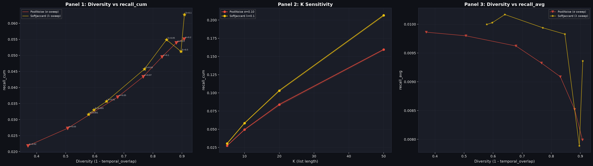

# Insight: Random Noise vs soft_jaccard DivLoss — 多様化推薦における2手法の特性比較

**実験**: Plan 008 / 009 / 010  
**データ**: MovieLens 1M | multilingual-e5-base (ZCA whitened) | K=10 | N_trials=10 | Seeds=5  
**アーキテクチャ**: Two-Tower (depth=2, hidden=64, BPR loss)

---

## 背景・研究動機

推薦システムにおいて「多様性」は重要な要件である。ユーザーが複数回推薦を受ける場合、
毎回同じアイテムが推薦されると累積カバレッジが伸びない。

本研究では **N 回試行した際の累積 Recall（recall_cum）** を多様化推薦の主要指標とし、
Two-Tower モデルに対して多様化を導入する2つのアプローチを比較した：

1. **PostNoise (Random)**: 学習済みモデルの推論時に user クエリベクトルへガウシアンノイズを付与する（再学習不要）
2. **soft_jaccard DivLoss**: 学習時に BPR 損失 + soft_jaccard 多様化損失で訓練し、推論時にもノイズを付与する

### 評価指標の定義

> 推薦リスト長 **K=10**、試行回数 **N_trials=10** で固定して評価。

| 指標 | 定義 | 意味 |
|---|---|---|
| `recall_cum` | `\|∪_t R_t ∩ GT\| / \|GT\|` | 10試行分の推薦リスト（各 @10）を合算した累積 Recall。最大100件でカバーできる割合。 |
| `recall_avg` | `mean_t [ \|R_t ∩ GT\| / \|GT\| ]` | 1試行あたりの Recall@10 の平均（単試行精度）。 |
| `diversity` | `1 - temporal_overlap` | 試行間のリスト重複率の逆数。1=完全に異なるリスト、0=毎回同一リスト。 |

---

## 手法の詳細

### PostNoise (Random)

```python
# 推論時のみノイズ付与（訓練は通常 BPR）
proj_user = user_head(whitened_user_emb)  # MLP変換後
noise = N(0, σ)
query = L2Norm(proj_user + noise)
```

- ハイパーパラメータ: σ（ノイズ強度）のみ
- 再学習不要 → 実装コスト最小
- σ を大きくするほど diversity ↑、hit@K ↓

### soft_jaccard DivLoss

```python
# 訓練時: 同一ユーザーの2クエリ q1, q2 を生成してリスト重複を最小化
L = BPR(q1) + BPR(q2) + λ × soft_jaccard(q1, q2, items)

# soft_jaccard = Σ min(p1_i, p2_i) / Σ max(p1_i, p2_i)  ← minimize
# 推論時: ノイズ付与（σ=0.05 固定）
```

- ハイパーパラメータ: λ（損失の重み）、σ（推論ノイズ）
- 訓練時に「異なる推薦リストを生成するよう」モデルの分布を整形する
- Plan 008 でのスイープ: λ ∈ {0.1, 0.5, 1.0}
- Plan 009 でのスイープ: λ ∈ {0.001, 0.005, 0.01, 0.03, 0.05, 0.1}（精密化）

---

## 比較グラフ



> **Panel 1** (左): σ/λ スイープ軌跡を重ねた Diversity vs recall_cum。同一 diversity 帯での高低が読み取れる。  
> **Panel 2** (中): K 感度分析。K を変えたときの recall_cum の変化。  
> **Panel 3** (右): Diversity vs recall_avg（単試行精度）。  

---

## 実験結果

### diversity を揃えた場合の比較（K=10, N_trials=10）

| diversity ≈ | PostNoise | recall_cum | soft_jaccard | recall_cum | 優位 |
|---|---|---|---|---|---|
| 0.37 | σ=0.02 | 0.0218 | — | — | — |
| 0.50 | σ=0.03 | 0.0273 | — | — | — |
| 0.57 | — | — | λ=0.001 | 0.0316 | SJ |
| 0.60 | — | — | λ=0.005 | 0.0330 | SJ |
| 0.64 | σ=0.05 | **0.0370** | λ=0.01 | 0.0357 | **PN** |
| 0.70 | σ=0.07 | **0.0433** | λ=0.03 | 0.0457 | SJ |
| 0.77 | — | — | λ=0.05 | 0.0549 | — |
| 0.83 | σ=0.10 | 0.0495 | λ=0.05 | **0.0549** | **SJ** (+11%) |
| 0.91 | σ=0.20 | 0.0551 | λ=0.10 | **0.0627** | **SJ** (+14%) |

### K 感度分析（PostNoise σ=0.10 vs soft_jaccard λ=0.1）

| K | PostNoise rc | soft_jaccard rc | 差（SJ 優位） |
|---|---|---|---|
| 5 | 0.0274 | **0.0304** | +11% |
| 10 | 0.0495 | **0.0585** | +18% |
| 20 | 0.0839 | **0.1031** | +23% |
| 50 | 0.1595 | **0.2064** | +29% |

### 余剰カバレッジの品質分析（Sub-exp 10C, N=5,821 users）

相手手法が持たない独自カバーアイテムの GT ヒット率を比較：

| 指標 | PostNoise σ=0.10 | soft_jaccard λ=0.1 |
|---|---|---|
| 平均カバレッジ数 | 55.0 items | **67.0 items** |
| 独自カバー数（相手にないもの） | 39.8 items | 51.8 items |
| **独自カバーの GT ヒット率** | **0.0086** | 0.0071 |
| SJ の方が精度が高いユーザー数 | — | 1,051 / 5,821 (18%) |

---

## Insights

### Insight 1: 低 diversity 帯（< 0.7）では PostNoise と soft_jaccard は拮抗

diversity < 0.7 の領域では両手法の recall_cum は同程度。
soft_jaccard の λ を小さくした軌跡と PostNoise の σ スイープ軌跡がほぼ重なる。
**再学習なしの PostNoise でも同等の効果が得られる。**

### Insight 2: 高 diversity 帯（> 0.8）では soft_jaccard が明確に優位

diversity 0.83 以上では soft_jaccard が PostNoise を一貫して上回り (+11〜14%)。
PostNoise では σ を大きくするほど recall_cum の伸びが鈍化するのに対し、
soft_jaccard は高 diversity を保ちながら recall_cum も高水準を維持する。

**soft_jaccard の訓練は「高 diversity 領域への到達効率」を改善している。**

### Insight 3: K が大きいほど soft_jaccard の優位が拡大

K=5 で +11%、K=50 で +29% と、推薦リストが長くなるほど差が広がる。
これは soft_jaccard が「多様なアイテムを広くカバーする」特性を持つためで、
**K を増やして推薦幅が広がるほど真価を発揮する。**
一方 PostNoise は K=5 のような短リストでは相対的に善戦する。

### Insight 4: 単試行精度（recall_avg）は PostNoise が一貫して優位

ほぼ全 diversity 帯で PostNoise の recall_avg が soft_jaccard を上回る。
**1回の推薦でヒットさせる能力は PostNoise が勝る。**
soft_jaccard の訓練が精度を一部犠牲にして多様性を獲得していると解釈できる。

### Insight 5: soft_jaccard の優位は「精度の高い多様化」ではなく「広く薄くカバー」型

独自カバーアイテムの GT ヒット率は PostNoise（0.0086）の方が soft_jaccard（0.0071）より高い。
soft_jaccard は多くのアイテムをカバーするが、そのうち真に有用なアイテムの割合は低い。

**soft_jaccard の recall_cum 優位の源泉は「広く薄く拾う」戦略であり、
訓練によって「意味のある多様化」が実現できているとは言い切れない。**

---

## 結論・使い分けの指針

| ユースケース | 推奨手法 | 理由 |
|---|---|---|
| N 回試行の累積カバレッジを最大化（探索型） | ✅ **soft_jaccard λ=0.1** | 高 diversity 帯で +14%、K 大で +29% |
| 1回の推薦セッションの精度を重視 | ✅ **PostNoise** | recall_avg で全帯域優位 |
| K=20〜50 の長いリストを出す設計 | ✅ **soft_jaccard** | K 感度で差が顕著に拡大 |
| 実装コストを最小化したい | ✅ **PostNoise** | 再学習不要、σ 1つで制御 |
| 独自カバーの GT 精度を重視 | ✅ **PostNoise** | GT ヒット率 0.0086 vs 0.0071 |

> **要約**: soft_jaccard は「累積カバレッジ・K 感度」で優位、PostNoise は「単試行精度・実装簡易性・独自カバー精度」で優位。
> 両者の差は diversity が高い領域で顕在化し、K が大きいほど拡大する。
> soft_jaccard の優位は「精度の高い多様化」ではなく「広く薄くカバーする」戦略によるもので、
> 追加の訓練コストに見合うかはユースケースに依存する。

---

## 参照

| 種別 | パス |
|---|---|
| 実験計画 | `experiment_plan/plan_008.md`, `plan_009.md`, `plan_010.md` |
| 結果データ | `report/plan_008/results.json`, `report/plan_009/results.json`, `report/plan_010/results.json` |
| 比較グラフ | `report/plan_010/comparison_010.png` |
| K 感度 CSV | `report/plan_010/k_sensitivity.csv` |
| 余剰カバレッジ CSV | `report/plan_010/extra_coverage.csv` |
| モデル実装 | `src/model/models_007.py` (TwoTowerPostNoise), `src/model/models_003.py` (div_soft_jaccard) |
| 学習ループ | `src/model/models_008.py` (TwoTowerDivLoss) |
