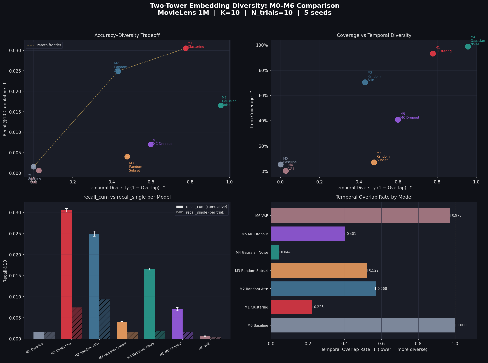

# Plan 001 実験結果レポート — MovieLens 1M
**Two-Tower Embedding Diversity: M0–M6 モデル比較**

実験日: 2026-07-30 | Dataset: MovieLens 1M | Seeds: 5 | K=10 | N_trials=10

---

## 実験設定

| 項目 | 内容 |
|---|---|
| Encoder | `intfloat/multilingual-e5-base` (frozen, 768-dim) |
| ANN Index | FAISS IndexFlatIP (CPU, item側固定) |
| Dataset | MovieLens 1M (6,040 users / 3,706 items / 1,000,209 ratings) |
| Split | 時系列 8:1:1 (per user) |
| Rating 閾値 | ≥ 4.0 |
| Test users w/ GT | 5,821 |
| K | 10 |
| N_trials | 10 (試行回数) |
| Seeds | 0, 1, 2, 3, 4 |
| GPU | NVIDIA RTX 5090 (34.2 GB VRAM) |
| PyTorch | 2.7.1+cu128 |

---

## 結果サマリー (mean ± std over 5 seeds)

| Model | recall_cum↑ | recall_single↑ | Hit@10↑ | NDCG@10↑ | Overlap↓ | ILD↑ | Coverage↑ |
|---|---|---|---|---|---|---|---|
| M0_baseline | 0.0016±0.0000 | 0.0016±0.0000 | 0.0151±0.0000 | 0.0017±0.0000 | **1.0000**±0.0000 | 0.1108±0.0000 | 5.4%±0.0% |
| M1_clustering | **0.0305**±0.0004 | 0.0074±0.0002 | 0.0402±0.0009 | 0.0053±0.0001 | **0.2228**±0.0005 | 0.0843±0.0000 | **93.3%**±0.1% |
| M2_random_attention | 0.0249±0.0006 | **0.0093**±0.0003 | **0.0479**±0.0004 | **0.0074**±0.0001 | 0.5681±0.0006 | 0.0811±0.0000 | 70.6%±0.4% |
| M3_random_subset | 0.0040±0.0001 | 0.0016±0.0000 | 0.0140±0.0003 | 0.0017±0.0000 | 0.5223±0.0005 | 0.1124±0.0000 | 7.0%±0.0% |
| M4_gaussian_noise | 0.0166±0.0002 | 0.0019±0.0000 | 0.0178±0.0004 | 0.0022±0.0000 | **0.0439**±0.0001 | **0.1187**±0.0000 | **98.9%**±0.2% |
| M5_mc_dropout | 0.0071±0.0004 | 0.0016±0.0001 | 0.0158±0.0005 | 0.0019±0.0001 | 0.4009±0.0004 | 0.1125±0.0000 | 40.7%±0.4% |
| M6_vae | 0.0006±0.0001 | 0.0005±0.0000 | 0.0039±0.0001 | 0.0008±0.0000 | 0.9733±0.0002 | 0.1097±0.0000 | 0.3%±0.0% |

### 指標の定義

| 指標 | 定義 |
|---|---|
| `recall_cum` | N_trials 回推薦の和集合と正解の重複 / 正解数。多様性が高いほど増加する |
| `recall_single` | 1試行あたりの平均 Recall@K |
| `Hit@10` | 推薦10件中に正解が1件以上含まれる割合 |
| `NDCG@10` | 順位を考慮した精度指標 |
| `Overlap` | 試行間の平均重複率 (低いほど多様) |
| `ILD` | リスト内アイテム間の平均コサイン距離 (高いほど多様) |
| `Coverage` | 全アイテムのうち推薦されたユニーク数の割合 |

---

## 精度×多様性 トレードオフ グラフ




## 主要な知見

### 1. ベースライン確認 (M0)
- `Overlap = 1.0000`：決定論的 ANN は毎回完全に同じリストを返す（期待通り）
- `recall_cum = recall_single = 0.0016`：多様性なし状態の基準値

### 2. 精度×多様性バランス最優秀：M1 Clustering 🏆
- `recall_cum = 0.0305`（**M0比 19倍**）
- `Overlap = 0.2228`（大幅低下）、`Coverage = 93.3%`
- ユーザーの正の訓練アイテムを K-means でクラスタリング (k=5)
- 試行ごとに異なるクラスタ重心をクエリとして使用
- item index を変更せずに高い精度と多様性を両立

### 3. 単回精度最高：M2 Random Attention
- `recall_single = 0.0093`、`Hit@10 = 0.0479`（全モデル最高）
- Dirichlet 重み付きの履歴アイテム組み合わせで多様なクエリを生成
- 中程度の多様性 (Overlap=0.57)

### 4. 多様性最高：M4 Gaussian Noise
- `Overlap = 0.0439`（全モデル最低）、`Coverage = 98.9%`
- σ=0.05 のガウスノイズ + 再正規化。実装が最もシンプル
- 精度は限定的 (`recall_single = 0.0019`)

### 5. M6 VAE の失敗分析
- `Overlap = 0.9733`（M0 に次ぐ高い重複率）、`Coverage = 0.3%`
- **根本原因**：MSE 再構成損失によりデコーダが embedding 空間の平均点へ収束
  - 潜在空間 z をサンプリングしても、デコード後の点がアイテム空間上で集中してしまう
  - 結果：異なる z → ほぼ同じ推薦リスト
- **改善方向**：コサイン損失 or Triplet 損失に変更、β を大きくして潜在空間を拡張

### 6. M3 / M5 の分析
- **M3 (random subset)**：MovieLens のユーザー属性（性別・年齢・職業）の変化が mE5 埋め込みに与える影響が小さい。属性次元が少なすぎる
- **M5 (mc dropout)**：中程度の多様性だが精度低下が大きい

---

## recall_cum vs recall_single の比較

`recall_cum - recall_single` の差が「有効な多様性の効果」を表す：

| Model | recall_single | recall_cum | 倍率 (cum/single) |
|---|---|---|---|
| M0 | 0.0016 | 0.0016 | ×1.0 (多様性ゼロ) |
| M1 | 0.0074 | 0.0305 | ×4.1 ✅ |
| M2 | 0.0093 | 0.0249 | ×2.7 |
| M3 | 0.0016 | 0.0040 | ×2.5 |
| M4 | 0.0019 | 0.0166 | ×8.7 (探索的) |
| M5 | 0.0016 | 0.0071 | ×4.4 |
| M6 | 0.0005 | 0.0006 | ×1.2 (VAE失敗) |

---


---

## 各手法の詳細とアーキテクチャ

### 共通アーキテクチャ

全モデルは以下の Two-Tower 構成を共有する。**item 側は完全固定**であり、多様性は query 側のみで実現する。

```
User 属性テキスト                    Item 属性テキスト
  ↓                                   ↓
multilingual-e5-base (frozen)       multilingual-e5-base (frozen)
  ↓ Average Pooling + L2 Norm          ↓ Average Pooling + L2 Norm
user_emb ∈ ℝ^768                    item_emb ∈ ℝ^768
  ↓                                   ↓
[各モデル固有の多様化処理]            FAISS IndexFlatIP (固定)
  ↓
query_vec ∈ ℝ^768 (L2正規化済み)
  ↓
inner_product(query_vec, item_embs)  →  Top-K 推薦
```

User テキスト: `"A {female|male} user aged {age_range}, working as {occupation}."`
Item テキスト: `"A movie titled '{title}' ({year}). Genres: {genre_list}."`

---

### M0 – Baseline（決定論的ベースライン）

**コンセプト:** ファインチューニングなし・多様化なし。frozen mE5 の出力をそのまま使う。

```
query_vec(trial t) = user_emb    # 全試行で同一
```

| パラメータ | 値 |
|---|---|
| 追加パラメータ | なし |
| prepare 時間 | 0s |

**期待される挙動:** `Overlap = 1.0`（毎回完全に同一リスト）。後続モデルの比較基準。

---

### M1 – Clustering（クラスタリング多ベクトル）

**コンセプト:** PinnerSage (Ying et al., 2020) にインスパイア。ユーザーの正インタラクションアイテムを K-means でクラスタリングし、複数の興味を代表する重心ベクトル群を生成。試行ごとに異なる重心を選ぶ。

```
prepare フェーズ:
  V_i = {item_emb[j] | j ∈ 訓練正アイテム集合}  shape: (n_pos, 768)
  → MiniBatchKMeans(k=min(5, n_pos))
  → centroids C_i = {c_0,...,c_{k-1}}  各 L2 正規化済み

推論フェーズ (trial t):
  idx = randint(0, k)
  query_vec = C_i[idx]
```

```
User history items:  v1 v2 v3  v4 v5   v6 v7 v8 v9 v10
                    [Cluster 0] [Clus1]  [  Cluster 2   ]
                        c0         c1          c2
                     ↑ trial=0  ↑ trial=1  ↑ trial=2
```

| パラメータ | 値 |
|---|---|
| `n_clusters (k)` | 5 |
| クラスタリング | MiniBatchKMeans, n_init=3, random_state=42 |
| prepare 時間 | 35.3s (6038 / 6040 users にクラスタ生成) |

---

### M2 – Random Attention（ランダムアテンション）

**コンセプト:** ComiRec (Cen et al., 2020) の multi-interest を学習なしで近似。Dirichlet 分布からサンプリングした重みで訓練アイテムを加重平均し、試行ごとに異なるユーザー表現を生成。

```
trial t:
  weights ~ Dirichlet(α=[1,1,...,1])   shape: (|V_i|,)
  q = Σ_j weights[j] · item_emb[j]
  query_vec = normalize(q)
```

| パラメータ | 値 |
|---|---|
| 重みの分布 | Dirichlet(α=1) |
| 学習パラメータ | なし |
| prepare 時間 | 0s |

M1（離散クラスタ重心）と異なり、M2 は連続的な凸結合。単回精度（Hit@10=0.0479）が全モデル中最高。

---

### M3 – Random Attribute Subset（属性サブセット）

**コンセプト:** テキストレベルの多様化。属性の一部を除外した 5 種類のユーザーテキストバリアントを事前に mE5 で埋め込み、試行ごとにランダム選択する。

```
variant 0 (full):      "A female user aged 25-34, working as engineer."
variant 1 (no occ):    "A female user aged 25-34."
variant 2 (no age):    "A female user, working as engineer."
variant 3 (no gender): "A user aged 25-34, working as engineer."
variant 4 (occ only):  "A user working as engineer."

→ 事前生成: user_embeddings_variants.npy  shape=(6040, 5, 768)

trial t:
  v_idx = randint(0, 5)
  query_vec = user_embeddings_variants[user_idx, v_idx]
```

| パラメータ | 値 |
|---|---|
| バリアント数 | 5 |
| 事前生成コスト | ~55s (GPU) |
| prepare 時間 | 0s (npy ロード) |

**限界:** MovieLens のユーザー属性は Gender/Age/Occupation の 3 次元のみ。属性変化が mE5 出力に与える影響が小さく、推薦変化が限定的（Overlap=0.52）。

---

### M4 – Gaussian Noise（ガウスノイズ）

**コンセプト:** user_emb に等方的ガウスノイズを加え再正規化。最もシンプルな確率的多様化。

```
trial t:
  ε ~ N(0, σ²·I)   σ = 0.05
  q_noisy = user_emb + ε
  query_vec = normalize(q_noisy)
```

| パラメータ | 値 |
|---|---|
| `sigma (σ)` | 0.05 |
| 学習パラメータ | なし |
| prepare 時間 | 0s |

Overlap=0.0439 で全モデル最低（最高多様性）。σ=0.05 は小さな値でも正規化後の方向変化は大きく、アイテム空間上の広範な探索につながる。

---

### M5 – MC Dropout（モンテカルロドロップアウト）

**コンセプト:** Gal & Ghahramani (2016) の MC Dropout を推薦多様化に応用。Inverted dropout をユーザー埋め込みに直接適用する（NN 重みへの適用ではなく入力特徴のマスキング）。

```
trial t:
  mask ~ Bernoulli(1 - p)   p = 0.2
  q_dropped = user_emb ⊙ mask / (1-p)   # inverted dropout
  query_vec = normalize(q_dropped)

user_emb: [u1, u2, u3, ..., u768]
trial=0:  [u1·s, 0,  u3·s, ...]  mask=[1,0,1,...]  (s=1.25)
trial=1:  [0,  u2·s, u3·s, ...]  mask=[0,1,1,...]
```

| パラメータ | 値 |
|---|---|
| `dropout_rate (p)` | 0.2 |
| スケーリング係数 | 1/(1-p) = 1.25 (inverted dropout) |
| 学習パラメータ | なし |
| prepare 時間 | 0s |

M4 と比べると多様性は中程度（Overlap=0.40）。バイナリマスクのため方向変化がランダムだが離散的。

---

### M6 – VAE（変分オートエンコーダ）

**コンセプト:** Kingma & Welling (2014) の VAE を user_emb に適用。確率的エンコーダで潜在空間 z をサンプリングし、デコードしたベクトルをクエリとして使用する。

```
エンコーダ:
  user_emb (768) → Linear(768→256) → ReLU
                 → μ(256→128),  log_σ²(256→128)

reparameterization:
  z = μ + σ·ε,   ε ~ N(0,I)  [各試行独立]

デコーダ:
  z (128) → Linear(128→256) → ReLU → Linear(256→768) → normalize → query_vec

訓練損失:
  L = MSE(recon, user_emb) + β · KL(N(μ,σ²) || N(0,I))
  β=1.0, epochs=100, batch_size=256, Adam lr=1e-3
```

| パラメータ | 値 |
|---|---|
| `latent_dim` | 128 |
| `beta (β)` | 1.0 |
| エンコーダ | Linear(768→256)→ReLU→{μ,logσ²}(256→128) |
| デコーダ | Linear(128→256)→ReLU→Linear(256→768) |
| 損失 | MSE + β·KL |
| 最適化 | Adam lr=1e-3, grad_clip=1.0 |
| prepare 時間 | 14.1s (GPU), Final loss=0.0001 |

**失敗分析 (Overlap=0.9733):**

1. **MSE 再構成損失の罠**: デコーダが embedding 空間の平均点へ収束。異なる z をサンプリングしてもデコード出力が狭い領域に集中する。
2. **Posterior collapse**: β=1.0 が弱く、エンコーダが μ≈user_emb, σ≈0 の点推定に退化。潜在空間の分散が小さすぎる。
3. **空間ミスアライン**: mE5 は対照学習による超球面分布だが、MSE 損失はユークリッド空間を前提とする。

**改善方向:** β を 4〜8 に増やす（β-VAE）/ MSE → Cosine 損失 / InfoNCE による対照学習

---

## 次のステップ（plan_002〜）

| 実験 | 内容 |
|---|---|
| plan_002 | M1 クラスタ数 K のチューニング (K=3,5,10,20) |
| plan_003 | M4 ノイズ強度 σ のチューニング（精度-多様性フロンティア） |
| plan_004 | M6 VAE 改善：コサイン損失 / β-VAE / 対照学習 |
| plan_005 | Yelp データセットへの拡張（ユーザー属性が豊富） |
| plan_006 | MMR / DPP ポスト処理との比較（クエリ側 vs 結果側多様化） |
