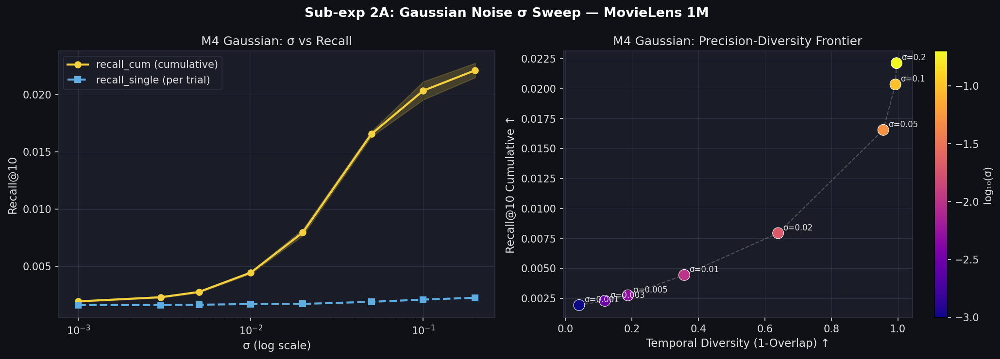
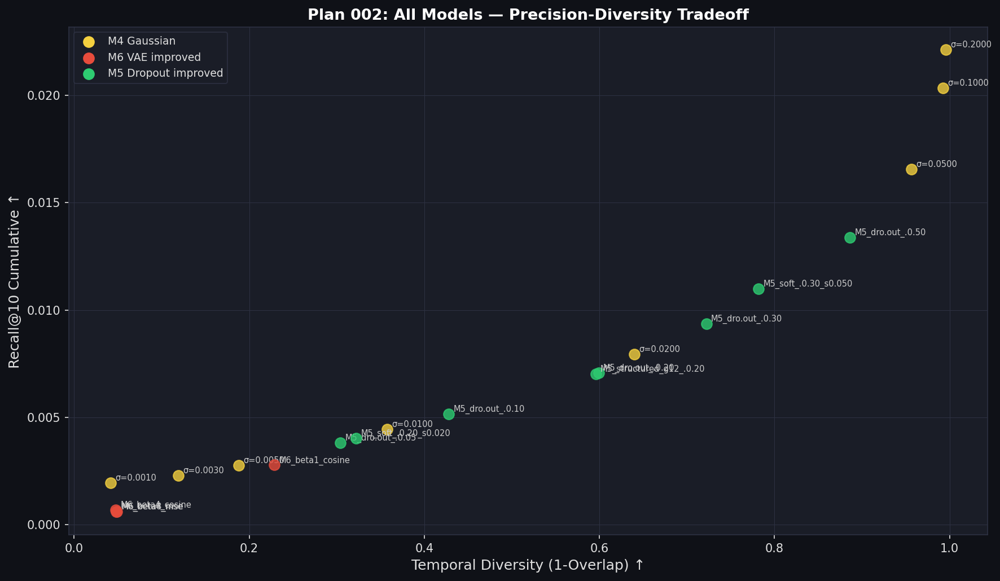

# Plan 002 実験結果レポート — MovieLens 1M
**行動履歴不要手法の深掘り: M4 Gaussian / M6 VAE改良 / M5 Dropout改良**

実験日: 2026-07-30 | Dataset: MovieLens 1M | Seeds: 5 | K=10 | N_trials=10

---

## 概要

Plan 001 で「行動履歴不要」かつ有望だった3手法を深掘りした。

| Sub-exp | テーマ | モデル数 |
|---|---|---|
| 2A | M4 Gaussian σ スイープ | 8 |
| 2B | M6 VAE 改良（β + 損失関数） | 4 |
| 2C | M5 Dropout 改良（rate + 構造化 + soft） | 8 |

---

## Sub-exp 2A: M4 Gaussian σ スイープ

### 結果

| σ | recall_cum↑ | overlap↓ | coverage↑ |
|---|---|---|---|
| 0.001 | 0.0019±0.0000 | 0.9586±0.0001 | 6.1% |
| 0.003 | 0.0023±0.0001 | 0.8812±0.0002 | 7.8% |
| 0.005 | 0.0028±0.0001 | 0.8119±0.0004 | 10.3% |
| 0.010 | 0.0044±0.0001 | 0.6424±0.0003 | 18.5% |
| 0.020 | 0.0079±0.0003 | 0.3601±0.0006 | 46.6% |
| 0.050 | 0.0166±0.0002 | 0.0439±0.0001 | 98.9% |
| 0.100 | 0.0203±0.0008 | 0.0073±0.0000 | **100.0%** |
| 0.200 | **0.0221**±0.0006 | **0.0040**±0.0000 | **100.0%** |

### 考察

- σ が 0.001→0.2 にかけて **recall_cum は単調増加**（0.0019→0.0221）
- σ が 0.001→0.2 にかけて **overlap は単調減少**（0.96→0.004）
- **σ=0.02** 付近が「多様性を得つつ recall_cum も引き上がる」変曲点
- σ=0.1〜0.2 では coverage=100%（全アイテムが推薦される）= ほぼランダム検索
- **σ=0.02 が精度-多様性のバランス最良**（recall_cum=0.0079, overlap=0.36）

---

## Sub-exp 2B: M6 VAE 改良

### 結果

| モデル | β | 損失 | recall_cum↑ | overlap↓ | cov |
|---|---|---|---|---|---|
| M6 (plan_001 ベース) | 1 | MSE | 0.0006 | 0.9733 | 0.3% |
| M6_beta4_mse | 4 | MSE | 0.0006±0.0001 | 0.9519±0.0001 | 0.4% |
| M6_beta8_mse | 8 | MSE | 0.0006±0.0000 | 0.9511±0.0002 | 0.3% |
| **M6_beta1_cosine** | 1 | **Cosine** | **0.0028**±0.0001 | **0.7711**±0.0002 | 0.8% |
| M6_beta4_cosine | 4 | Cosine | 0.0007±0.0000 | 0.9523±0.0001 | 0.3% |

### 考察

**MSE損失のβ強化（M6a/b）は効果なし**
- β=4,8 に上げても overlap=0.95 で改善せず
- Posterior collapse の根本原因は **mE5 の embedding 空間が超球面分布** であること
  - MSE損失はユークリッド距離を最小化する → 球面上の幾何と根本的に合わない
  - どれだけ KL を強めても、デコーダが平均点に収束する構造は変わらない

**Cosine 損失のみ β=1 が唯一の改善（M6c）**
- overlap が 0.97→0.77 に低下（+20ポイント改善）
- recall_cum も 0.0006→0.0028（5倍）に向上
- しかし coverage=0.8% と依然低い = 推薦が狭い空間に集中している

**Cosine + β=4（M6d）は逆効果**
- β を大きくすると KL が強すぎて潜在空間の情報が失われる（情報圧縮しすぎ）
- 最適は `Cosine loss + β=1`

**追加的な問題点（未解決）**
- デコーダが L2 空間で正規化前の点を出力するため、正規化後に近傍に集中する
- 根本解決には VAE の潜在空間をそのままアイテム空間として使う設計変更が必要
  （= デコーダを廃止し、エンコーダの μ から直接クエリを生成する AE 型）

---

## Sub-exp 2C: M5 Dropout 改良

### 結果

| モデル | recall_cum↑ | overlap↓ | coverage↑ |
|---|---|---|---|
| M5_dropout p=0.05 | 0.0038±0.0002 | 0.6961±0.0003 | 15.8% |
| M5_dropout p=0.10 | 0.0052±0.0002 | 0.5721±0.0004 | 23.9% |
| M5_dropout p=0.20 | 0.0071±0.0004 | 0.4009±0.0004 | 40.7% |
| **M5_dropout p=0.30** | **0.0094**±0.0003 | **0.2779**±0.0006 | 57.8% |
| M5_dropout p=0.50 | 0.0134±0.0009 | 0.1136±0.0002 | 88.8% |
| M5_structured g=12 p=0.20 | 0.0070±0.0003 | 0.4042±0.0004 | 39.1% |
| M5_soft p=0.20 σ=0.02 | 0.0040±0.0002 | 0.6777±0.0004 | 16.4% |
| **M5_soft p=0.30 σ=0.05** | **0.0110**±0.0004 | **0.2181**±0.0003 | 70.5% |

### 考察

**Rate sweep (p スイープ): M4 Gaussian と同様の単調トレードオフ**
- p が増えるほど recall_cum 増加・overlap 減少
- Gaussian と異なり recall_single はほぼ一定（0.0016〜0.0019）
  → 1回あたりの精度を維持しながら多様性を増やすのが難しい

**Structured Dropout: 通常 Dropout と同等**
- p=0.20 同士で比較: structured 0.0070 vs 通常 0.0071
- グループ単位マスクも次元単位マスクも推薦精度に大差なし

**Soft Dropout: M4 Gaussian との中間的挙動**
- p=0.30, σ=0.05: recall_cum=0.0110、overlap=0.2181
- 同 overlap 帯では M4_sigma0.02（overlap=0.36）や M5_dropout_p0.30（overlap=0.28）と競合
- Soft Dropout の独自の強みは現れず、M4 か通常 Dropout で代替可能

---

## 総合比較: plan_001 + plan_002 ベスト候補

| モデル | recall_cum | overlap | cov | 特徴 |
|---|---|---|---|---|
| M0_baseline | 0.0016 | 1.0000 | 5.4% | 基準値 |
| M4_sigma0.020 | 0.0079 | 0.3601 | 46.6% | **バランス最良** ⭐ |
| M4_sigma0.050 | 0.0166 | 0.0439 | 98.9% | 高多様性 |
| M4_sigma0.100 | 0.0203 | 0.0073 | 100% | ほぼランダム |
| M5_dropout_p0.30 | 0.0094 | 0.2779 | 57.8% | Dropout系ベスト |
| M5_soft_p0.30 | 0.0110 | 0.2181 | 70.5% | Soft Dropout |
| M6_beta1_cosine | 0.0028 | 0.7711 | 0.8% | VAE系唯一の改善 |

---

## トレードオフグラフ

---

## 次の実験への示唆

1. **M4 Gaussian の最適 σ は 0.01〜0.03 の範囲** でさらに細かく探索する価値あり
2. **VAE の改善方向**: デコーダ廃止 + エンコーダ出力を直接クエリにする Auto-Encoder 型
3. **Dropout は M4 Gaussian の代替にならない**: 同じトレードオフ曲線上にあるが M4 の方が実装が簡単
4. **行動履歴不要手法の最有力候補: M4 Gaussian (σ=0.02)**
