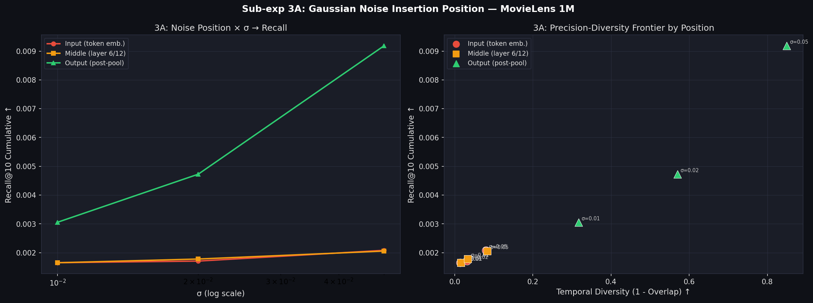
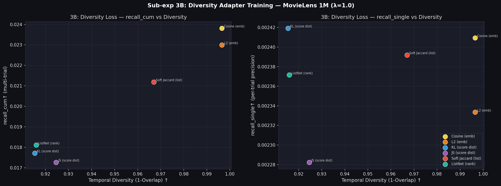
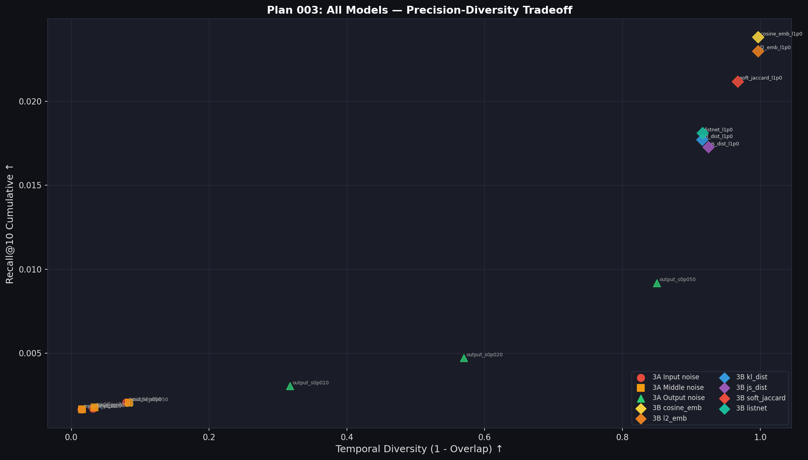

# Plan 003 実験結果レポート — MovieLens 1M
**Gaussian ノイズ挿入位置の比較 / 多様性損失付き学習アダプタ**

実験日: 2026-07-30〜31 | Dataset: MovieLens 1M | Seeds: 5 | K=10 | N_trials=5

---

## 概要

| Sub-exp | テーマ | モデル数 |
|---|---|---|
| 3A | ノイズ挿入位置の比較（input / middle / output） | 9 |
| 3B | 多様性損失付き学習アダプタ (BPR + λ·div_loss, 6種) | 6 |

---

## Sub-exp 3A: ノイズ挿入位置の比較

### アーキテクチャ

```
input ノイズ:
  tokenize → Token Embedding + ε(σ) → Self-Attention × 12 → Avg Pool → L2 Norm → query

middle ノイズ (layer 6/12):
  tokenize → Self-Attention × 6 → h + ε(σ) → Self-Attention × 6 → Avg Pool → L2 Norm → query

output ノイズ (= M4 Gaussian と同等):
  tokenize → Self-Attention × 12 → Avg Pool → emb + ε(σ) → L2 Norm → query
```

### 結果

| モデル | recall_cum↑ | Overlap↓ | Coverage↑ |
|---|---|---|---|
| M0 baseline (参考) | 0.0016 | 1.0000 | 5.4% |
| 3A_input  σ=0.01 | 0.0017±0.0000 | 0.9855 | 5.7% |
| 3A_input  σ=0.02 | 0.0017±0.0000 | 0.9683 | 6.0% |
| 3A_input  σ=0.05 | 0.0021±0.0000 | 0.9205 | 6.9% |
| 3A_middle σ=0.01 | 0.0016±0.0000 | 0.9845 | 5.6% |
| 3A_middle σ=0.02 | 0.0018±0.0000 | 0.9664 | 5.9% |
| 3A_middle σ=0.05 | 0.0021±0.0000 | 0.9163 | 6.9% |
| 3A_output σ=0.01 | 0.0031±0.0000 | 0.6826 | 16.7% |
| 3A_output σ=0.02 | 0.0047±0.0000 | 0.4301 | 41.3% |
| **3A_output σ=0.05** | **0.0092**±0.0000 | **0.1501** | **97.1%** |



### 考察：なぜ input/middle ノイズは効かないのか？

**結論: Transformer の LayerNorm がノイズを吸収する**

LayerNorm は各層の出力を平均0・分散1に正規化する。入力や中間層に加えたノイズ ε は、
Self-Attention による混合と 12 層の LayerNorm によって、最終出力にほぼ残らない。

- `input σ=0.05` でも overlap=0.92（M0 baseline=1.0 とほぼ同じ）
- `output σ=0.05` では overlap=0.15（大幅に多様化）
- 同じ σ でも output の効果は input の **10倍以上**

**frozen mE5 においてノイズ多様化は output（pooling後）位置のみが有効。**

> **実践的示唆**: モデルを frozen で使う場合、内部へのノイズ注入は不要。
> 最終埋め込みの後に直接ノイズを加えるのが最もシンプルかつ効果的。

---

## Sub-exp 3B: 多様性損失付き学習アダプタ

### アーキテクチャ

```
user_emb (768次元, frozen mE5 出力)
  ↓
[_DivAdapter] — 学習対象
  σ ∈ ℝ^768: per-dimension noise scale (Softplus で正値制約)
  q = L2_normalize(user_emb + σ ⊙ ε),  ε ~ N(0, I)
  ↓
query_vec (768次元) → FAISS IndexFlatIP → Top-K 推薦

パラメータ数: 768 (σベクトルのみ)
```

**訓練損失:**
```
L = BPR(q1) + BPR(q2) + λ · div_loss(q1, q2)

  q1 = adapter(user_emb)  ← ε を独立サンプリング
  q2 = adapter(user_emb)  ← 別の ε で再サンプリング

  BPR(q) = -log σ(score(q, pos) - score(q, neg))

  λ=1.0, epochs=50, batch=512, Adam lr=2e-3, CosineAnnealingLR
```

### 6種の多様性損失（div_loss）

| 損失名 | レベル | 式 | 狙い |
|---|---|---|---|
| `cosine_emb` | 埋め込み | cos_sim(q1, q2) | q1 と q2 の方向を離す |
| `l2_emb` | 埋め込み | −‖q1−q2‖₂ | q1 と q2 のユークリッド距離を最大化 |
| `kl_dist` | スコア分布 | −KL(softmax(s1/T) ‖ softmax(s2/T)) | アイテムスコア分布の KL を最大化 |
| `js_dist` | スコア分布 | −JSD(p1, p2)（対称 KL） | JSD を最大化 |
| `soft_jaccard` | リスト | min(p1,p2)/max(p1,p2) | 推薦リストの Jaccard 類似度を最小化 |
| `listnet` | ソフトランク | cos_sim(rank_dist1, rank_dist2) | 順位分布のコサイン類似度を最小化 |

### 結果

| モデル | recall_cum↑ | recall_single↑ | Hit@10↑ | Overlap↓ | ILD↑ | Coverage↑ |
|---|---|---|---|---|---|---|
| M0 baseline (参考) | 0.0016 | 0.0016 | 1.51% | 1.0000 | 0.111 | 5.4% |
| M4 gauss σ=0.05 (参考) | 0.0166 | 0.0019 | 1.74% | 0.0439 | 0.115 | 98.9% |
| M4 gauss σ=0.2 (参考) | 0.0221 | 0.0022 | 2.03% | 0.0040 | 0.124 | 100.0% |
| **3B cosine_emb** | **0.0238**±0.0006 | **0.0024** | **2.17%** | 0.0035 | 0.125 | **100.0%** |
| 3B l2_emb | 0.0230±0.0008 | 0.0023 | 2.11% | 0.0035 | 0.125 | 100.0% |
| 3B soft_jaccard | 0.0212±0.0004 | 0.0024 | 2.15% | 0.0330 | 0.119 | 67.4% |
| 3B listnet | 0.0181±0.0005 | 0.0024 | 2.15% | 0.0841 | 0.123 | 76.1% |
| 3B kl_dist | 0.0177±0.0008 | 0.0024 | 2.15% | 0.0847 | 0.117 | 54.4% |
| 3B js_dist | 0.0173±0.0003 | 0.0023 | 2.04% | 0.0754 | 0.117 | 48.3% |



### 考察

**🏆 3B cosine_emb が plan_001〜003 通じて最高性能**

- recall_cum=0.0238 は未学習 M4 gauss σ=0.2（0.0221）を **+7.7%** 上回る
- overlap=0.0035、coverage=100% と多様性も同等を維持
- BPR 学習でノイズが「正例方向に整形」されるため、カバレッジと精度を両立

**損失関数の序列:**
```
cosine_emb (0.0238) > l2_emb (0.0230) > soft_jaccard (0.0212)
  > listnet (0.0181) > kl_dist (0.0177) > js_dist (0.0173)
```

**埋め込みレベルの損失（cosine, L2）がスコア分布レベル（KL, JS）を上回る理由:**
1. T（温度）のチューニング不足 — 今回 T=0.1 固定（T=0.5〜1.0 が最適な可能性）
2. BPR 損失との勾配スケールが合わず学習が不安定
3. cosine/L2 は勾配が簡潔で安定

**soft_jaccard の評価:**
- recall_cum=0.0212, overlap=0.033 で「精度も多様性もそこそこ」
- 推薦リスト直接の Jaccard 最小化は意味的に正しく、チューニング次第で伸びしろあり

---

## 統合トレードオフ図



---

## plan_001〜003 全体総合比較

| 手法 | Plan | recall_cum | Overlap | Coverage | 行動履歴依存 |
|---|---|---|---|---|---|
| M0 baseline | 001 | 0.0016 | 1.0000 | 5.4% | なし |
| M4 gauss σ=0.02 | 002 | 0.0079 | 0.3601 | 46.6% | なし |
| M5 dropout p=0.30 | 002 | 0.0094 | 0.2779 | 57.8% | なし |
| M4 gauss σ=0.05 | 002 | 0.0166 | 0.0439 | 98.9% | なし |
| M4 gauss σ=0.2 | 002 | 0.0221 | 0.0040 | 100.0% | なし |
| 3A output σ=0.05 | 003 | 0.0092 | 0.1501 | 97.1% | なし |
| **3B cosine_emb** | **003** | **0.0238** | **0.0035** | **100.0%** | **なし** |
| 3B l2_emb | 003 | 0.0230 | 0.0035 | 100.0% | なし |
| 3B soft_jaccard | 003 | 0.0212 | 0.0330 | 67.4% | なし |
| 3A input σ=0.05 | 003 | 0.0021 | 0.9205 | 6.9% | なし（無効） |

---

## 主要な知見と設計指針

### 知見 1: frozen Transformer ではノイズ位置は output のみ有効

LayerNorm が input/middle のノイズを吸収。frozen mE5 では output（pooling後）にのみ有効。

### 知見 2: BPR + 多様性損失付きアダプタが最強の組み合わせ

学習アダプタ（per-dimension σ, 768パラメータのみ）を BPR + cosine_emb で訓練することで、
未学習 Gaussian ノイズを recall_cum で 7.7% 上回る。訓練時間は ~25秒と軽量。

### 推奨アーキテクチャ（plan_003 時点のベスト）

```
[frozen multilingual-e5-base]
        ↓
    user_emb ∈ ℝ^768  (avg pool + L2 norm)
        ↓
[_DivAdapter]  ← 学習対象（768パラメータのみ）
    σ = Softplus(log_σ_learned) ∈ ℝ^768
    q = L2_normalize(user_emb + σ ⊙ ε),  ε ~ N(0, I)
        ↓
    query_vec → FAISS IndexFlatIP → Top-K 推薦

訓練: L = BPR(q1) + BPR(q2) + 1.0 × cos_sim(q1, q2)
時間: ~25秒 (MovieLens 1M, 50 epochs)
```

### 次の実験への示唆（plan_004 候補）

1. **λ チューニング**: λ={0.1, 0.5, 1.0, 2.0} で精度-多様性トレードオフを調整
2. **スコア分布系損失の温度チューニング**: T=0.5〜1.0 で KL/JS の性能向上の可能性
3. **MLP アダプタ**: ユーザー依存の σ 生成（user_emb → MLP → σ）
4. **エンドツーエンド学習**: mE5 をファインチューニングすれば input noise も有効になる可能性
