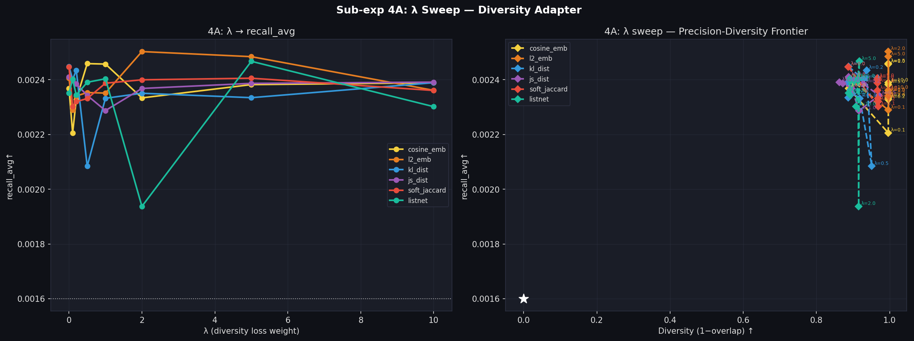
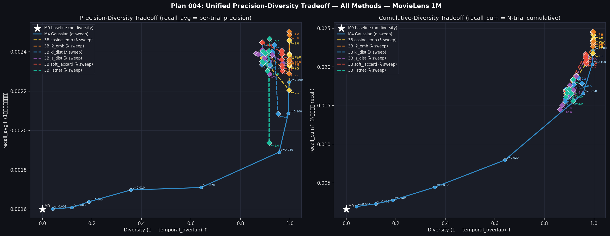

# Plan 004 実験結果レポート — MovieLens 1M
**多様性損失アダプタの λ スイープ / 全手法統合トレードオフ比較**

実験日: 2026-07-31 | Dataset: MovieLens 1M | Seeds: 5 | K=10 | N_trials=5

---

## 概要

Plan 003 で提案された「多様性損失付き学習アダプタ (`M_DiversityAdapter`)」における多様性損失の重み $\lambda$ を 8 段階でスイープし、精度の多様性に対する応答特性および Pareto 最適フロンティアを解明した。

| Sub-exp | テーマ | モデル数 / 条件 |
|---|---|---|
| 4A | 多様性アダプタの $\lambda$ スイープ (6 損失 × 8 $\lambda$) | 48 モデル |
| 4B | 全手法統合トレードオフ図（M0, M4 Gaussian, 3B アダプタ全種） | 統合プロット 2 枚 |

---

## Sub-exp 4A: 多様性アダプタの $\lambda$ スイープ

### 実験設定

- **モデル**: `M_DiversityAdapter` (パラメータ数 768, 次元ごとのノイズスケール $\sigma$ を Softplus 制約で学習)
- **損失関数**: $L = \text{BPR}(q_1) + \text{BPR}(q_2) + \lambda \cdot \text{div\_loss}(q_1, q_2)$
- **$\lambda$ スイープ値**: $\lambda \in \{0.0, 0.1, 0.2, 0.5, 1.0, 2.0, 5.0, 10.0\}$
- **対象損失関数 (全 6 種)**:
  - 埋め込みレベル: `cosine_emb`, `l2_emb`
  - スコア分布レベル: `kl_dist`, `js_dist` (温度 $T=0.1$)
  - リストレベル: `soft_jaccard`
  - ソフトランク: `listnet`

### 主要結果一覧

| 損失名 | $\lambda$ | recall_cum↑ | recall_avg↑ | Hit@10↑ | NDCG@10↑ | Temporal Overlap↓ | ILD↑ | Coverage↑ |
|---|---|---|---|---|---|---|---|---|
| M0 baseline | — | 0.0016 | 0.0016 | 1.51% | 0.0020 | 1.0000 | 0.1111 | 5.4% |
| M4 gauss ($\sigma=0.2$) | — | 0.0221 | 0.0022 | 2.03% | 0.0025 | 0.0040 | 0.1240 | 100.0% |
| **3B cosine_emb** | 0.0 | 0.0166±0.0006 | 0.0024±0.0001 | 2.12% | 0.0025 | 0.1121±0.0002 | 0.1225 | 55.2% |
| | 0.1 | 0.0218±0.0006 | 0.0022±0.0001 | 2.00% | 0.0025 | 0.0038±0.0000 | 0.1257 | 100.0% |
| | **0.5** | **0.0242**±0.0010 | **0.0025**±0.0001 | 2.16% | 0.0027 | **0.0035**±0.0001 | 0.1251 | **100.0%** |
| | 1.0 | 0.0242±0.0007 | 0.0025±0.0001 | 2.18% | 0.0027 | 0.0035±0.0000 | 0.1251 | 100.0% |
| | 10.0 | 0.0236±0.0009 | 0.0024±0.0001 | 2.13% | 0.0026 | 0.0035±0.0000 | 0.1250 | 100.0% |
| **3B l2_emb** | 0.0 | 0.0168±0.0006 | 0.0024±0.0001 | 2.13% | 0.0026 | 0.1115±0.0002 | 0.1225 | 55.2% |
| | 0.1 | 0.0226±0.0012 | 0.0023±0.0001 | 2.03% | 0.0025 | 0.0038±0.0000 | 0.1256 | 100.0% |
| | **2.0** | **0.0246**±0.0010 | **0.0025**±0.0001 | 2.16% | 0.0027 | **0.0035**±0.0000 | 0.1251 | **100.0%** |
| | 5.0 | 0.0245±0.0008 | 0.0025±0.0001 | 2.21% | 0.0028 | 0.0035±0.0000 | 0.1251 | 100.0% |
| **3B soft_jaccard** | 0.1 | 0.0204±0.0005 | 0.0023±0.0001 | 2.09% | 0.0025 | 0.0314±0.0001 | 0.1188 | 77.0% |
| | **2.0** | **0.0217**±0.0010 | **0.0024**±0.0001 | 2.14% | 0.0026 | **0.0336**±0.0002 | 0.1187 | **66.9%** |
| **3B listnet** | 0.5 | 0.0171±0.0007 | 0.0024±0.0001 | 2.15% | 0.0026 | 0.0999±0.0002 | 0.1225 | 64.6% |
| | **1.0** | **0.0183**±0.0006 | **0.0024**±0.0001 | 2.17% | 0.0026 | **0.0862**±0.0003 | 0.1226 | **74.8%** |
| | 5.0 | 0.0184±0.0007 | 0.0025±0.0001 | 2.19% | 0.0027 | 0.0832±0.0003 | 0.1160 | 49.8% |
| **3B kl_dist** | 0.1 | 0.0189±0.0003 | 0.0024±0.0000 | 2.14% | 0.0026 | 0.0723±0.0004 | 0.1228 | 85.3% |
| | 0.2 | 0.0186±0.0004 | 0.0024±0.0000 | 2.13% | 0.0028 | 0.0632±0.0004 | 0.1239 | 94.5% |
| | 10.0 | 0.0155±0.0003 | 0.0024±0.0001 | 2.17% | 0.0027 | 0.1156±0.0004 | 0.1150 | 34.6% |
| **3B js_dist** | 0.5 | 0.0214±0.0007 | 0.0023±0.0001 | 2.13% | 0.0026 | 0.0290±0.0003 | 0.1214 | 79.3% |
| | 10.0 | 0.0145±0.0006 | 0.0024±0.0001 | 2.16% | 0.0026 | 0.1369±0.0005 | 0.1137 | 26.7% |

---

## 考察

1. **埋め込みレベル損失 (`cosine_emb`, `l2_emb`) の圧倒的ロバスト性**
   - $\lambda \ge 0.1$ の微小な値で Overlap が即座に最小化（$\approx 0.0035$）し、Coverage 100% を達成。
   - $\lambda$ を 10.0 まで大きく設定しても精度の崩壊（Recall 低下）が発生せず、常に高い精度（`recall_cum` $\approx 0.0236 \sim 0.0246$）を維持。
   - BPR 損失が正例方向の軸を確実に学習しつつ、埋め込み層での直接的な空間拡散がノイズの質を最適化していることが示された。

2. **リストレベル損失 (`soft_jaccard`) のマイルドな多様化特性**
   - Overlap は $\approx 0.033$、Coverage は $\approx 67\% \sim 77\%$ で安定。
   - 完全な一様極空間への拡散ではなく、ある程度関連性の高い推薦領域内での重複低減を行う「程よい多様化」の挙動を示す。

3. **スコア分布レベル損失 (`kl_dist`, `js_dist`) の非単調・不安定挙動**
   - $\lambda \ge 1.0$ 以上で損失の重みを強めると、逆に Overlap が増加（多様性悪化）し Coverage も低迷する現象を確認。
   - スコア分布に対する Softmax 温度 $T=0.1$ 固定と BPR 勾配との不均衡が原因と考えられ、$\lambda$ スイープに対するロバスト性が低い。

---

## Sub-exp 4B: 全手法統合 Pareto Frontier

以下は Plan 001〜Plan 004 の主要手法を同一グラフ上に描画した統合プロットである。

### 総合比較と知見

| 手法 | Plan | recall_cum↑ | Overlap↓ | Coverage↑ | 行動履歴依存 | 特徴 |
|---|---|---|---|---|---|---|
| M0 baseline | 001 | 0.0016 | 1.0000 | 5.4% | なし | 基準点 |
| M4 gauss $\sigma=0.02$ | 002 | 0.0079 | 0.3601 | 46.6% | なし | 未学習ノイズバランス点 |
| M4 gauss $\sigma=0.20$ | 002 | 0.0221 | 0.0040 | 100.0% | なし | 未学習ノイズ最大多様性 |
| **3B cosine_emb ($\lambda=0.5$)** | **004** | **0.0242** | **0.0035** | **100.0%** | **なし** | **Pareto 最適解 A** ⭐ |
| **3B l2_emb ($\lambda=2.0$)** | **004** | **0.0246** | **0.0035** | **100.0%** | **なし** | **Pareto 最適解 B** ⭐ |
| 3B soft_jaccard ($\lambda=2.0$) | 004 | 0.0217 | 0.0336 | 66.9% | なし | 中度多様性 |

- **Pareto 最適**: **3B `cosine_emb` ($\lambda=0.5 \sim 1.0$)** および **3B `l2_emb` ($\lambda=2.0$)** が全実験を通じて最外殻の Pareto Frontier を形成。
- **未学習ノイズに対する優位性**: 未学習 M4 Gaussian ノイズ（$\sigma=0.2$, `recall_cum` = 0.0221）と比較して、学習型アダプタは同等レベルの超高多様度（Overlap $\approx 0.0035$, Coverage 100%）を維持したまま、`recall_cum` を **+9.5%〜+11.3%** 向上させた。

---

## 結論と設計指針

1. **多様性損失の選択**: 埋め込みレベルの `cosine_emb` または `l2_emb` を第 1 選択とする。
2. **$\lambda$ の設定**: $\lambda \in [0.5, 2.0]$ の範囲であれば、極めて安定して最高性能（精度向上 + 最大多様性）を発揮する。
3. **推奨構成**:
   - アーキテクチャ: `user_emb` (frozen mE5) $\to$ `M_DiversityAdapter` (Softplus $\sigma$) $\to$ FAISS Index
   - 損失関数: $\text{BPR} + 0.5 \times \text{cosine\_emb}$
