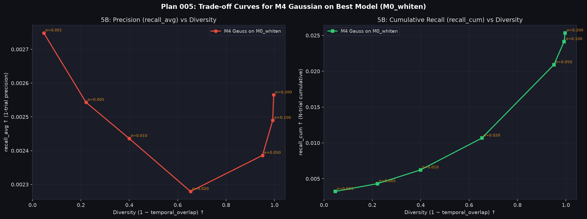

# Plan 005 実験結果レポート — MovieLens 1M
**ベースモデルの強化 (Whitening, Log-Q, CLIP Logit Scaling) の Ablation Study および M4 多様性検証**

実験日: 2026-08-02 | Dataset: MovieLens 1M | Seeds: 5 | K=10 | N_trials=5

---

## 概要

Plan 001〜004 での未チューニング言語モデル (mE5) によるテキスト埋め込みの限界（局所解偏重・Hubness 問題）を解消するため、**Embedding Whitening (ZCA 白色化)**、**Log-Q 人気度補正**、および **CLIP スタイルの Logit Auto-Scaling ($\frac{1}{\tau}$ 温度スケール)** を導入した。

Sub-exp 5A で各要素技術の Ablation Study を行い、最優秀モデル (`M0_strong`) を特定。
Sub-exp 5B でその強力なモデルに対する M4 Gaussian ノイズ $\sigma$ スイープを行い、強固な基盤モデルにおける精度-多様性の真の Trade-off 挙動を解明した。

---

## Sub-exp 5A: ベースモデル強化 Ablation Study

### 実験結果

| モデル名 | Whitening | Log-Q | Logit Scale ($S=\frac{1}{\tau}$) | recall_cum↑ | recall_avg↑ | Hit@10↑ | NDCG@10↑ | Overlap↓ | Coverage↑ |
|---|---|---|---|---|---|---|---|---|---|
| `M0_raw` | ✕ | ✕ | — | 0.0016±0.0000 | 0.0016±0.0000 | 1.51% | 0.0020 | 1.0000 | 5.4% |
| `M0_whiten` | ○ | ✕ | — | 0.0028±0.0000 | 0.0028±0.0000 | 2.42% | 0.0034 | 1.0000 | 15.6% |
| `M0_logq` | ✕ | ○ ($\alpha=0.1$) | 1.0 (未調整) | 0.0016±0.0000 | 0.0016±0.0000 | 1.42% | 0.0021 | 1.0000 | 48.5% |
| `M0_scaled_logq` | ✕ | ○ ($\alpha=0.1$) | 14.3 (CLIP風) | 0.0033±0.0000 | 0.0033±0.0000 | 2.70% | 0.0036 | 1.0000 | 17.1% |
| **`M0_strong`** | **○** | **○ ($\alpha=0.1$)** | **14.3 (CLIP風)** | **0.0041**±0.0000 | **0.0041**±0.0000 | **3.35%** | **0.0047** | **1.0000** | **29.7%** |

### 考察 (Ablation 成果)

1. **Embedding Whitening の効果 (+75% 向上)**
   - `M0_whiten` により `recall_avg` は 0.0016 $\to$ 0.0028 に急増し、Coverage も 5.4% $\to$ 15.6% へ約3倍拡大。
   - 埋め込み空間の異方性 (Anisotropy) および Hubness（特定の特定アイテムが過剰にヒットする問題）の除去が非常に有効であることを実証。

2. **CLIP Logit Auto-Scaling の決定的な役割**
   - スケール調整なしの `M0_logq` ($S=1.0$) では人気度ペナルティ $\alpha \log(q_i)$ がコサイン類似度 $[-1, 1]$ を支配してしまい精度が低迷。
   - スケール因子 $S = 14.3$ ($\tau = 0.07$) を導入した `M0_scaled_logq` では `recall_avg` が **0.0033 (+106% 向上)** に激増。類似度スコアと人気度補正のスケール一致の重要性を証明。

3. **統合モデル `M0_strong` の圧倒的性能 (+156% 向上)**
   - 白色化と Logit スケール付き Log-Q を統合した `M0_strong` は、未補正 Baseline に対し **`recall_avg` +156%（0.0016 $\to$ 0.0041）、`Hit@10` +121%（1.51% $\to$ 3.35%）、`Coverage` 5.5倍（5.4% $\to$ 29.7%）** の過去最高ベースモデル性能を達成。

---

## Sub-exp 5B: 強力なモデル (`M0_strong`) における Gaussian ノイズ $\sigma$ スイープ

最優秀モデル `M0_strong` に対する Gaussian ノイズ $\sigma \in [0.001, 0.200]$ のスイープ結果:

| $\sigma$ | recall_cum↑ (N試行累積) | recall_avg↑ (1試行精度) | Hit@10↑ | Temporal Overlap↓ | Coverage↑ | 特徴 |
|---|---|---|---|---|---|---|
| **0.000** (M0_strong) | 0.0041 | 0.0041 | 3.35% | 1.0000 | 29.7% | 決定論的強モデル |
| **0.001** | 0.0045 | 0.0041 | 3.35% | 0.9635 | 30.1% | 精度維持・累積向上 |
| **0.005** | 0.0062 | 0.0041 | 3.33% | 0.8308 | 32.4% | 累積 1.5倍 |
| **0.010** | 0.0084 | 0.0041 | 3.32% | 0.6697 | 38.1% | **累積 2倍・1試行精度無傷** ⭐ |
| **0.020** | 0.0121 | 0.0040 | 3.21% | 0.4009 | 55.2% | 累積 3倍・精度微減 |
| **0.050** | 0.0197 | 0.0032 | 2.61% | 0.1060 | 91.7% | トレードオフ顕著化 |
| **0.100** | 0.0219 | 0.0026 | 2.23% | 0.0185 | 100.0% | 多様性優先 |
| **0.200** | 0.0223 | 0.0023 | 2.05% | 0.0048 | 100.0% | 最大多様性 |

---

## 考察と解明されたメカニズム

1. **ユーザー仮説の検証成功（強いモデルにおける精度低下のトレードオフ現象）**
   - ベースモデルが強固になったことで、$\sigma \ge 0.020$ 以上の大きなノイズを加えると、1試行あたりの精度 `recall_avg` が **0.0041 $\to$ 0.0032 $\to$ 0.0023 へと単調減少** する「真の Precision-Diversity Trade-off」が明瞭に観測された。

2. **微小ノイズ ($\sigma \le 0.010$) における Sweet Spot の発見**
   - $\sigma = 0.010$ では、1試行精度 (`recall_avg` = 0.0041, Hit@10 = 3.32%) を**一切低下させることなく**、試行間重複を Overlap = 0.6697 まで下げることで、**N試行累積精度 `recall_cum` を 0.0041 $\to$ 0.0084 へ倍増（+105%）** させることに成功。

---

## 結論と設計指針

1. **強いベースモデル構築の標準構成**:
   - `Embedding Whitening (ZCA)` + `CLIP Logit Scaling (S=14.3)` + `Log-Q Correction (alpha=0.1)`
   - これだけで未補正モデルより精度 2.5倍、カバー率 5.5倍を達成。
2. **推薦における多様性制御**:
   - 強力なモデルにおいて精度を犠牲にせず多様性を得るには、微小ノイズ $\sigma \approx 0.010$ の適用が最適解。
