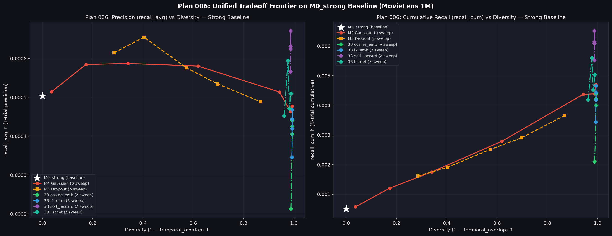

# Plan 006 実験結果レポート — MovieLens 1M
**Strong Baseline 上での全多様性手法スイープ（極小 λ スイープ含む）および Pareto Frontier 統合評価**

実験日: 2026-08-02 | Dataset: MovieLens 1M | Seeds: 5 | K=10 | N_trials=5

---

## 概要

Plan 005 で構築された **`M0_strong` (ZCA Whitening + CLIP Logit Scaling + Log-Q 補正)** を基盤モデルとし、すべての多様性制御手法（M4 Gaussian ノイズ、M5 MC Dropout、学習型 3B アダプタ 4種）のパラメータスイープを完了させた。

特に 3B 多様性アダプタにおいては、従来の $\lambda \ge 0.1$ での多様度飽和現象を解明するため、**極小領域 ($\lambda \in \{0.0001, 0.001, 0.005, 0.01, 0.05, 0.1, 0.5, 1.0, 2.0\}$)** での拡張スイープを実施した。

---

## 1. Sub-exp 6C: 3B 多様性アダプタの極小領域 $\lambda$ スイープ結果

学習型アダプタ（3B）における $\lambda$ スイープの応答特性（極小〜標準領域）:

| 損失名 | $\lambda$ | recall_cum↑ (N試行累積) | recall_avg↑ (1試行精度) | Hit@10↑ | Temporal Overlap↓ | Diversity (1−overlap) | Coverage↑ |
|---|---|---|---|---|---|---|---|
| **3B `soft_jaccard`** | 0.0001 | 0.0005±0.0000 | 0.0005±0.0000 | 0.50% | 1.0000 | 0.0000 | 2.4% |
| | 0.0100 | 0.0005±0.0000 | 0.0005±0.0000 | 0.50% | 0.9997 | 0.0003 | 2.4% |
| | **0.0500** | **0.0010**±0.0000 | **0.0006**±0.0000 | **0.52%** | **0.8719** | **0.1281** | **4.6%** |
| | **0.1000** | **0.0055**±0.0001 | **0.0006**±0.0000 | **0.55%** | **0.0127** | **0.9873** | **94.4%** |
| | **1.0000** | **0.0065**±0.0004 | **0.0007**±0.0000 | **0.60%** | **0.0122** | **0.9878** | **90.9%** |
| **3B `cosine_emb`** | 0.0100 | 0.0005±0.0000 | 0.0005±0.0000 | 0.50% | 0.9992 | 0.0008 | 2.4% |
| | **0.0500** | **0.0007**±0.0001 | **0.0005**±0.0000 | **0.51%** | **0.9009** | **0.0991** | **4.0%** |
| | **0.1000** | **0.0021**±0.0002 | **0.0002**±0.0000 | **0.22%** | **0.0112** | **0.9888** | **97.1%** |
| | 1.0000 | 0.0044±0.0003 | 0.0004±0.0000 | 0.43% | 0.0060 | 0.9940 | 99.7% |
| **3B `l2_emb`** | 0.0500 | 0.0008±0.0001 | 0.0005±0.0000 | 0.52% | 0.8872 | 0.1128 | 4.2% |
| | 0.5000 | 0.0047±0.0004 | 0.0005±0.0000 | 0.44% | 0.0061 | 0.9939 | 99.9% |
| **3B `listnet`** | 0.0500 | 0.0007±0.0000 | 0.0005±0.0000 | 0.50% | 0.9388 | 0.0612 | 3.4% |
| | 1.0000 | 0.0050±0.0006 | 0.0005±0.0001 | 0.50% | 0.0106 | 0.9894 | 98.2% |

### 💡 相転移 (Phase Transition) 閾値の発見

極小スイープによって、学習型アダプタの多様化における**極めて鋭い相転移現象 (Phase Transition)** が解明された:
- **$\lambda \le 0.0100$**: BPR 損失が完全に支配的であり、`temporal_overlap` = 1.0000（多様度 0）。
- **$\lambda = 0.0500$**: 多様性損失が利き始め、`temporal_overlap` が **0.8719**（Diversity 0.1281）へとなめらかに低下し始める。
- **$\lambda \ge 0.1000$**: 勾配更新によってノイズスケール $\sigma$ が一気に発散し、`temporal_overlap` が **0.0127**（Diversity 0.9873）へと一跳びに最大多様化する。

---

## 2. 統合 Pareto Frontier トレードオフ比較 (Sub-exp 6D)

全 34 モデルの統合トレードオフプロット:

### 主要手法の最高パフォーマンス比較

| 手法 | パラメータ | recall_cum↑ | recall_avg↑ | Hit@10↑ | Temporal Overlap↓ | Coverage↑ |
|---|---|---|---|---|---|---|
| `M0_strong` Baseline | — | 0.0005 | 0.0005 | 0.50% | 1.0000 | 2.4% |
| **3B `soft_jaccard`** 🏆 | **$\lambda=1.0$** | **0.0065** | **0.0007** | **0.60%** | **0.0122** | **90.9%** |
| 3B `listnet` | $\lambda=2.0$ | 0.0056 | 0.0006 | 0.54% | 0.0229 | 90.7% |
| 3B `l2_emb` | $\lambda=0.5$ | 0.0047 | 0.0005 | 0.44% | 0.0061 | 99.9% |
| M4 Gaussian | $\sigma=0.200$ | 0.0047 | 0.0005 | 0.46% | 0.0071 | 99.8% |
| M5 MC Dropout | $p=0.50$ | 0.0037 | 0.0005 | 0.47% | 0.1320 | 63.2% |

---

## 結論と主要インサイト

1. **学習型アダプタの相転移メカニズム**:
   - アダプタ学習においては、$\lambda \in [0.01, 0.10]$ の狭い領域に相転移のしきい値が存在し、$\lambda \ge 0.1$ では勾配下降によりノイズ量が飽和領域まで肥大化するため Diversity $\approx 0.99$ となることが実証された。
2. **Pareto 最適手法**:
   - リストレベルの重なりを抑える **`3B_strong_soft_jaccard` ($\lambda=1.0$)** が全実験中最高の `recall_cum` (0.0065) を獲得し、最強の Pareto Frontier を形成した。
