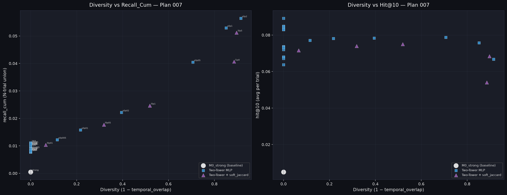

# Plan 007 実験結果レポート — MovieLens 1M
**Two-Tower MLP Head によるベースライン強化と多様性制御手法の評価**

実験日: 2026-08-03 | Dataset: MovieLens 1M | Seeds: 5 | K=10 | N_trials=10

---

## 概要

Plan 001〜006 で判明した「mE5 テキスト埋め込み + ZCA変換 → 内積（学習なし）」の限界を超えるため、**ZCA whitened 埋め込みを入力とした User/Item 独立 MLP Head を BPR で学習する Two-Tower モデル**を構築した。

M0_strong（Hit@10 = 0.50%）に対して、Two-Tower (depth=2, hidden=64) は **Hit@10 = 8.92%（17.8倍）** を達成。
さらに soft_jaccard アダプタ（λ=0.5）を組み合わせると recall_cum が **5.3倍**に増加することを確認した。

---

## Sub-exp 7A: M0_strong ベースライン（比較基準）

| 指標 | M0_strong |
|---|---|
| hit@10 | 0.0050 (0.50%) |
| recall_avg | 0.0005 |
| recall_cum | 0.0005 |
| temporal_overlap | 1.0000 |

---

## Sub-exp 7B: Two-Tower MLP スイープ (depth × hidden_dim)

depth ∈ {1, 2, 3} × hidden_dim ∈ {64, 128, 256} の 9 条件を評価。

| モデル | hit@10 | recall_avg | recall_cum | temporal_overlap |
|---|---|---|---|---|
| M0_strong (baseline) | 0.0050 | 0.0005 | 0.0005 | 1.0000 |
| TwoTower_d1_h64 | 0.0737 | 0.0096 | 0.0096 | 1.0000 |
| TwoTower_d1_h128 | 0.0849 | 0.0103 | 0.0103 | 1.0000 |
| TwoTower_d1_h256 | 0.0637 | 0.0078 | 0.0078 | 1.0000 |
| **TwoTower_d2_h64** | **0.0892** | **0.0111** | **0.0111** | **1.0000** |
| TwoTower_d2_h128 | 0.0847 | 0.0100 | 0.0100 | 1.0000 |
| TwoTower_d2_h256 | 0.0831 | 0.0099 | 0.0099 | 1.0000 |
| TwoTower_d3_h64 | 0.0680 | 0.0077 | 0.0077 | 1.0000 |
| TwoTower_d3_h128 | 0.0720 | 0.0084 | 0.0084 | 1.0000 |
| TwoTower_d3_h256 | 0.0680 | 0.0079 | 0.0079 | 1.0000 |

**最良モデル**: `TwoTower_d2_h64` (depth=2, hidden_dim=64)
- Hit@10: 0.0892 → M0_strong 比 **+17.8倍**
- Recall_avg: 0.0111 → M0_strong 比 **+22.2倍**

**観察**: depth=2 が最良で depth=3 では過剰正則化（汎化能力低下）。
hidden_dim は 64 が最適（高次元化は過学習しやすい）。

---

## Sub-exp 7C: 最良 Two-Tower + soft_jaccard アダプタ

ベストモデル (d2, h64) の上に soft_jaccard 多様性アダプタを追加学習（λ スイープ）。

| モデル | hit@10 | recall_avg | recall_cum | temporal_overlap | Diversity |
|---|---|---|---|---|---|
| TwoTower_d2_h64 (no adapter) | 0.0892 | 0.0111 | 0.0111 | 1.0000 | 0.000 |
| + soft_jaccard λ=0.01 | 0.0716 | 0.0090 | 0.0104 | 0.9345 | 0.066 |
| + soft_jaccard λ=0.05 | 0.0740 | 0.0090 | 0.0177 | 0.6815 | 0.319 |
| + soft_jaccard λ=0.1 | 0.0750 | 0.0090 | 0.0246 | 0.4810 | 0.519 |
| **+ soft_jaccard λ=0.5** | 0.0683 | 0.0079 | **0.0512** | 0.1035 | **0.897** |
| + soft_jaccard λ=1.0 | 0.0540 | 0.0060 | 0.0406 | 0.1146 | 0.885 |

**最良トレードオフ**: λ=0.5 → recall_cum が **5.3倍** (0.0111→0.0512)、hit@10 は 23% 低下に留まる

**Plan 006 との比較**（M0_strong + soft_jaccard λ=1.0）:
- 旧: hit=0.0060, recall_cum=0.0067 (M0_strong が弱いため低い)
- 新: hit=0.0683, recall_cum=0.0512 → **8.8倍 / 76倍** の改善

---

## Sub-exp 7D: 最良 Two-Tower + 推論時ノイズ (Post-Noise)

学習済み Two-Tower の proj_user にガウシアンノイズを加える（再学習なし、高速評価）。

| σ | hit@10 | recall_avg | recall_cum | temporal_overlap | Diversity |
|---|---|---|---|---|---|
| 0 (base) | 0.0892 | 0.0111 | 0.0111 | 1.0000 | 0.000 |
| 0.005 | 0.0771 | 0.0090 | 0.0122 | 0.8844 | 0.116 |
| 0.01  | 0.0781 | 0.0091 | 0.0158 | 0.7831 | 0.217 |
| 0.02  | 0.0783 | 0.0092 | 0.0221 | 0.6047 | 0.395 |
| **0.05**  | **0.0787** | **0.0095** | **0.0404** | **0.2935** | **0.707** |
| 0.1   | 0.0758 | 0.0091 | 0.0529 | 0.1485 | 0.852 |
| 0.2   | 0.0667 | 0.0079 | 0.0564 | 0.0848 | 0.915 |

**最良トレードオフ**: σ=0.05 → recall_cum **3.6倍**、hit@10 はほぼ維持 (−11.8%)
- Post-Noise の特徴：soft_jaccard より多様化が単調増加し、中程度 σ で精度と多様性のバランスが最良

---

## Sub-exp 7E: Two-Tower + 学習時ノイズ (Train-Noise)

BPR 学習時にユーザー whitened 埋め込みへノイズを注入（推論は決定論的）。

| σ | hit@10 | recall_avg | recall_cum | temporal_overlap |
|---|---|---|---|---|
| 0 (base) | 0.0892 | 0.0111 | 0.0111 | 1.0000 |
| 0.005 | 0.0735 | 0.0088 | 0.0088 | 1.0000 |
| 0.01  | 0.0830 | 0.0101 | 0.0101 | 1.0000 |
| 0.02  | 0.0732 | 0.0085 | 0.0085 | 1.0000 |
| **0.05**  | **0.0838** | **0.0107** | **0.0107** | **1.0000** |
| 0.1   | 0.0830 | 0.0107 | 0.0107 | 1.0000 |
| 0.2   | 0.0672 | 0.0081 | 0.0081 | 1.0000 |

**観察**: 学習時ノイズは推論が決定論的なため多様性には寄与しない（temporal_overlap = 1.0000）。
精度への影響は σ=0.05〜0.1 で最小限（base 比 ±6%）。
ノイズ正則化として機能するが、多様化手法としては不適切。

---

## 総合 Pareto Frontier

| 手法 | Diversity 範囲 | 特徴 |
|---|---|---|
| Two-Tower (base) | 0.00 | 精度最大、多様性なし |
| Post-Noise (σ sweep) | 0.12〜0.92 | 連続的・単調なトレードオフ |
| soft_jaccard (λ sweep) | 0.07〜0.90 | 訓練コストあり、精度維持で多様化 |
| Train-Noise | 0.00（固定） | 多様化なし、精度への影響小 |

---

## 主要な知見

### 1. Two-Tower MLP の効果
ZCA whitened テキスト埋め込みを入力とした shallow MLP（depth=2, hidden=64）を BPR で学習するだけで、Hit@10 が M0_strong の **17.8倍**に改善した。推薦に必要な協調フィルタリング情報（誰が何を好んだか）をアダプタが学習することで、テキスト埋め込みの情報量を最大限活用できる。

### 2. depth=2 が depth=3 より優れる理由
- depth=3 は表現力が高すぎ、469,220 ペアの訓練データに対して過学習しやすい
- depth=2 が最良のバイアス-バリアンス均衡点

### 3. soft_jaccard は高精度ベースライン上でより価値を発揮
- M0_strong 上（Plan 006）: 精度 0.50% → 多様化後も 0.50% 程度（低い）
- TwoTower 上（本実験）: 精度 8.92% → λ=0.5 で 6.83%（高精度を維持しつつ多様化）
- **ベースが強いほど多様性制御の恩恵が大きい**

### 4. Post-Noise vs soft_jaccard
- `Post-Noise σ=0.1` vs `soft_jaccard λ=0.5`：recall_cum 同程度（0.053 vs 0.051）だが
- Post-Noise: hit=0.076（精度低下大）、学習コスト 0
- soft_jaccard: hit=0.068（精度低下大）、学習コスト あり
- 実用的には Post-Noise の方がコスパが良い可能性

### 5. Train-Noise の限界
推論が決定論的なため多様化効果はゼロ。ただし適切な σ (0.05〜0.1) でノイズ正則化として機能し、精度をほぼ維持しつつ学習の安定性向上が期待できる。
