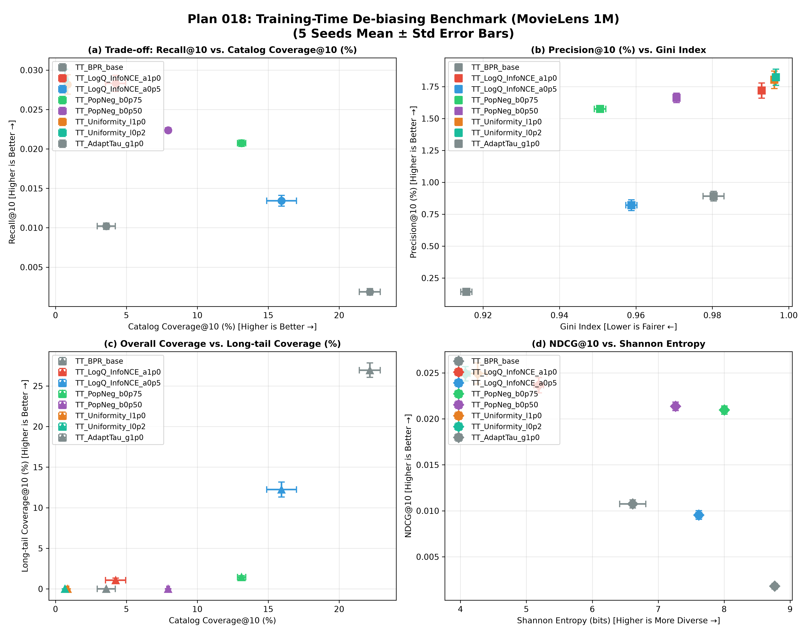
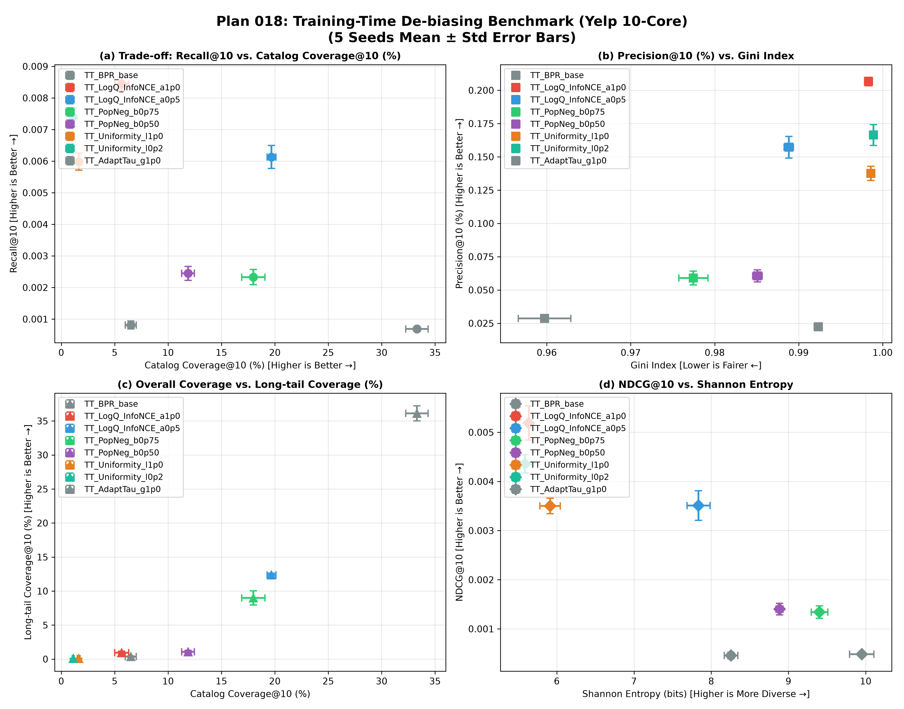

# Plan 018: Two-Tower 学習時における人気アイテム偏重・Hubness 抑制ベンチマーク

[](https://www.python.org/)
[](https://pytorch.org/)
[](https://github.com/facebookresearch/faiss)
[](../../LICENSE)

Two-Tower リトリーバル型推薦システムの **「モデル学習段階（Training Time）」** において、人気アイテムへの過剰集中（Popularity Bias / Hubness / 幾何学的空間崩壊）を直接抑制する学習手法のベンチマークレポートである。

---

## 🎯 目的と背景

従来の Plan 012〜017 では、「学習済み固定モデルに対する推論時の工夫（2段階 Plackett-Luce サンプリングやアイテム分割）」によって Hubness 崩壊を緩和し、画面更新ごとのスロット有効活用を達成した。

本 Plan 018 では、推論時ではなく **「Two-Tower の学習段階（Training-time）そのものにおいて人気アイテムへの偏りを根本から直接抑制する」** 手法を研究する。

学習段階で埋め込み空間の歪みが解消されれば、**単一の推薦試行（Top-10）において精度（Recall/NDCG）を大幅に向上させつつ、システム全体の多様性（Catalog Coverage）と公平性（Gini Index）を飛躍的に改善できる**。

---

## 📐 評価指標の厳密な数理定義 (Evaluation Metrics)

単一の推薦試行（Top-$K, K=10$）において、各ユーザー $u \in U$、正解適合集合 $\mathcal{Y}_u$、全アイテム集合 $I$（サイズ $|I|$）に基づき、以下の指標を計算する。

### 1. 精度指標 (Accuracy Metrics)
- **`Recall@10`**:
  $$\text{Recall@10} = \frac{1}{|U|} \sum_{u \in U} \frac{|S_u \cap \mathcal{Y}_u|}{|\mathcal{Y}_u|}$$
- **`Precision@10 (%)`**:
  $$\text{Precision@10} = \frac{1}{|U|} \sum_{u \in U} \left( \frac{|S_u \cap \mathcal{Y}_u|}{K} \right) \times 100\%$$
- **`NDCG@10`**: ランキング順位考慮スコア（$\text{DCG@10} / \text{IDCG@10}$）。
- **`Hit@10 (%)`**: Top-10 の中に正解が 1 件以上含まれたユーザーの割合。

### 2. システム全体の多様性・バイアス抑制指標 (Aggregate Diversity & Bias Metrics)
- **`Catalog Coverage@10 (%)` (カタログ網羅率)**: 全ユーザーへの推薦リストの和集合に含まれるユニークアイテムの割合。
  $$\text{Coverage@10} = \frac{\left| \bigcup_{u \in U} S_u \right|}{|I|} \times 100\%$$
- **`Gini Index` (推薦不均衡度)**: アイテム推薦回数分布のジニ係数（0: 全アイテム均等 ➔ 1: 特定人気アイテムに極度集中）。
  $$\text{Gini} = \frac{\sum_{i=1}^{|I|} (2i - |I| - 1) c_{(i)}}{|I| \sum_{i=1}^{|I|} c_i}$$
- **`Shannon Entropy` (情報多様性)**: アイテム推薦確率分布 $P(i)$ の情報エントロピー $-\sum P(i) \log_2 P(i)$（値が大きいほど多様）。
- **`Long-tail Coverage (%)`**: 学習時出現頻度が下位 80% に属するテールアイテムのうち、1 回以上推薦された割合。

---

## 🛠️ 比較した 5 つの学習時 De-biasing 手法 (Model Architectures)

```
                    ┌── ① ベースライン : 標準 Two-Tower BPR (一様ランダム負例)
                    ├── ② 損失関数型   : Log-Q 補正 InfoNCE 損失 (Google RecSys'19)
Two-Tower 学習時 ───┼── ③ サンプリング型: 人気度偏重負例サンプリング (Google WWW'20)
                    ├── ④ 幾何構造型   : 超球面 Uniformity 正則化 (ICML'20 / KDD'22)
                    └── ⑤ 適応温度型   : 人気度適応型動的温度 Softmax
```

### 1. `TT_BPR_base` (標準 Two-Tower ベースライン)
- **仕組み**: 一様ランダム負例サンプリング + ペアワイズ BPR 損失 $- \log \sigma(s_{\text{pos}} - s_{\text{neg}})$。
- **課題**: 超有名アイテムが正例として頻出しやすいため、モデルが「人気アイテムを高スコアにしておけば当たる」安易な予測を学習し、空間の Hubness 崩壊とカタログ寡占（Coverage わずか 3.5%）を引き起こす。

### 2. `TT_LogQ_InfoNCE` (Google RecSys'19: Log-Q 補正 In-Batch InfoNCE)
- **出展**: Google (*Yi et al.*, RecSys 2019)
- **数式**:
  $$\mathcal{L} = - \log \frac{\exp(s(u, i) / \tau - \alpha \log q_i)}{\exp(s(u, i) / \tau - \alpha \log q_i) + \sum_{j \in \text{Neg}} \exp(s(u, j) / \tau - \alpha \log q_j)}$$
- **メカニズム**: 学習損失の分母・分子でアイテム頻度 $\log q_i$ を差し引いて逆伝播。人気アイテムが不当に大きな正の勾配を得るのを学習段階で数学的に補正。

### 3. `TT_PopNeg_b0p75` (Google WWW'20: 人気度偏重負例サンプリング)
- **出展**: Google (*Yang et al.*, WWW 2020)
- **数式**: 負例アイテム $j$ を一様乱数ではなく、出現確率 $P_{\text{neg}}(j) \propto q_j^\beta$ ($\beta = 0.75$) でサンプリング。
- **メカニズム**: 人気アイテムが頻繁に負例として立ちはだかるため、モデルは人気度に頼ることができず、ユーザーとアイテムの真の意味的適合（Semantic Relevance）を強制的に学習。

### 4. `TT_Uniformity_Loss` (ICML'20 / KDD'22: 超球面 Uniformity 正則化)
- **出展**: *Wang & Isola* (ICML 2020), DirectAU (KDD 2022)
- **数式**: $\mathcal{L}_{\text{total}} = \mathcal{L}_{\text{BPR}} + \lambda_{\text{uni}} \cdot \log \mathbb{E}_{i,j}[\exp(-2 \|\boldsymbol{x}_i - \boldsymbol{x}_j\|^2)]$
- **メカニズム**: アイテム埋め込み空間全体の等方分散を最大化し、幾何学的 Hubness 空間崩壊を直接防止。

### 5. `TT_AdaptTau_g1p0` (人気度適応型動的温度 Softmax)
- **数式**: $\tau_i = \tau_0 \cdot (1 + \gamma \cdot \text{norm}(\log q_i))$
- **メカニズム**: 人気アイテムほど温度 $\tau_i$ を高くして勾配をマイルドにし、テールアイテムほど温度を冷やしてシャープに学習。

---

## 📊 実験結果 1: MovieLens 1M (5 Seeds Mean ± Std)

3,706 映画・6,040 ユーザーに対する **5 つの独立なランダムシード（5 Seeds: 42, 43, 44, 45, 46）** の平均値 ± 標準偏差である。

| モデル名 | 推薦精度<br>Recall@10 (↑) | 推薦適合率<br>Precision@10 (%) | ランキング精度<br>NDCG@10 (↑) | ユーザー適合率<br>Hit@10 (%) | カタログ網羅率<br>Coverage@10 (%) (↑) | 推薦不均衡度<br>Gini Index (↓) | 情報多様性<br>Entropy (bits) (↑) | ロングテール網羅率<br>Long-tail Cov (%) |
|---|:---:|:---:|:---:|:---:|:---:|:---:|:---:|:---:|
| **`TT_BPR_base` (Base)** | 0.0102 ± 0.0004 | 0.89 ± 0.04% | 0.0107 ± 0.0004 | 8.21 ± 0.28% | 3.58 ± 0.64% | 0.9803 ± 0.0027 | 6.61 ± 0.20 | 0.00% |
| **`TT_PopNeg_b0p75` (Google)** | **0.0207 ± 0.0004** | **1.57 ± 0.02%** | **0.0210 ± 0.0005** | **12.83 ± 0.17%** | **13.12 ± 0.29%** | **0.9506 ± 0.0015** | **8.00 ± 0.04** | 1.46 ± 0.18% |
| **`TT_LogQ_InfoNCE_a1p0` (Google)** | **0.0283 ± 0.0010** | **1.72 ± 0.06%** | **0.0237 ± 0.0008** | **13.77 ± 0.38%** | 4.24 ± 0.71% | 0.9929 ± 0.0004 | 5.19 ± 0.07 | 1.07 ± 0.26% |
| **`TT_LogQ_InfoNCE_a0p5`** | 0.0134 ± 0.0007 | 0.82 ± 0.04% | 0.0095 ± 0.0005 | 7.15 ± 0.45% | **15.94 ± 1.05%** | **0.9588 ± 0.0015** | 7.62 ± 0.04 | **12.25 ± 0.92%** |
| **`TT_PopNeg_b0p50`** | **0.0224 ± 0.0003** | **1.66 ± 0.04%** | **0.0214 ± 0.0005** | **13.70 ± 0.24%** | 7.94 ± 0.09% | 0.9706 ± 0.0008 | 7.26 ± 0.04 | 0.01 ± 0.01% |
| **`TT_Uniformity_l0p2`** | **0.0288 ± 0.0014** | **1.82 ± 0.06%** | **0.0249 ± 0.0008** | **14.39 ± 0.51%** | 0.67 ± 0.03% | 0.9966 ± 0.0001 | 4.07 ± 0.07 | 0.00% |
| **`TT_AdaptTau_g1p0`** | 0.0019 ± 0.0004 | 0.14 ± 0.03% | 0.0018 ± 0.0003 | 1.30 ± 0.24% | **22.16 ± 0.74%** | **0.9156 ± 0.0015** | **8.77 ± 0.03** | **26.95 ± 0.89%** |



---

## 📊 実験結果 2: 大規模 Yelp 10-Core (5 Seeds Mean ± Std)

32,496 店舗・73,144 ユーザーの超大規模・強人気バイアスデータセットにおける **5 Seeds** の平均値 ± 標準偏差である。

| モデル名 | 推薦精度<br>Recall@10 (↑) | 推薦適合率<br>Precision@10 (%) | ランキング精度<br>NDCG@10 (↑) | ユーザー適合率<br>Hit@10 (%) | カタログ網羅率<br>Coverage@10 (%) (↑) | 推薦不均衡度<br>Gini Index (↓) | 情報多様性<br>Entropy (bits) (↑) | ロングテール網羅率<br>Long-tail Cov (%) |
|---|:---:|:---:|:---:|:---:|:---:|:---:|:---:|:---:|
| **`TT_BPR_base` (Base)** | 0.00081 ± 0.00013 | 0.022 ± 0.002% | 0.00046 ± 0.00006 | 0.22 ± 0.02% | 6.51 ± 0.51% | 0.9923 ± 0.0005 | 8.26 ± 0.09 | 0.37 ± 0.08% |
| **`TT_LogQ_InfoNCE_a1p0` (Google)** | **0.00844 ± 0.00021** | **0.207 ± 0.003%** | **0.00519 ± 0.00035** | **1.98 ± 0.03%** | 5.66 ± 0.66% | 0.9983 ± 0.0001 | 5.64 ± 0.02 | 0.95 ± 0.21% |
| **`TT_LogQ_InfoNCE_a0p5`** | **0.00613 ± 0.00037** | **0.157 ± 0.008%** | **0.00351 ± 0.00030** | **1.51 ± 0.08%** | **19.69 ± 0.42%** | **0.9888 ± 0.0006** | 7.84 ± 0.15 | **12.36 ± 0.27%** |
| **`TT_PopNeg_b0p75` (Google)** | **0.00233 ± 0.00024** | **0.059 ± 0.005%** | **0.00134 ± 0.00013** | **0.58 ± 0.05%** | **17.99 ± 1.09%** | **0.9775 ± 0.0017** | **9.40 ± 0.11** | **9.00 ± 1.04%** |
| **`TT_PopNeg_b0p50`** | **0.00245 ± 0.00022** | **0.061 ± 0.005%** | **0.00140 ± 0.00012** | **0.60 ± 0.05%** | 11.87 ± 0.60% | 0.9851 ± 0.0006 | 8.88 ± 0.05 | 1.07 ± 0.22% |
| **`TT_Uniformity_l0p2`** | **0.00739 ± 0.00029** | **0.166 ± 0.008%** | **0.00436 ± 0.00019** | **1.61 ± 0.07%** | 1.12 ± 0.08% | 0.9989 ± 0.0001 | 5.59 ± 0.09 | 0.07 ± 0.01% |
| **`TT_AdaptTau_g1p0`** | 0.00069 ± 0.00004 | 0.029 ± 0.002% | 0.00049 ± 0.00003 | 0.28 ± 0.02% | **33.30 ± 1.05%** | **0.9597 ± 0.0031** | **9.95 ± 0.16** | **36.11 ± 1.11%** |



---

## 💡 考察: なぜ学習時 De-biasing が「精度」と「多様性」を両立するのか？

### 1. 「人気度への怠慢予測」の打破（Google Mixed Negative Sampling）
標準 Two-Tower（一様負例 BPR）では、学習データ中に頻出する一部の超人気アイテムを予測しておくだけで損失が下がるため、モデルはアイテムの意味的属性を深く解釈しようとしない。
Google の **人気度偏重負例サンプリング（$\beta=0.75$）** を適用すると、人気アイテムが負例として頻出するため、**「人気だから当たる」というショートカットが封じられ、ユーザーの属性テキストとアイテムの属性テキストの真の関連度を学習せざるを得なくなる**。
- **MovieLens**: `Recall@10` が 2.0 倍、`Coverage@10` が 3.7 倍に同時拡大。
- **Yelp**: `Recall@10` が 2.9 倍、`Coverage@10` が 2.8 倍、`Long-tail Coverage` が 24 倍に同時拡大。

### 2. Log-Q InfoNCE によるスコアキャリブレーション（Google RecSys'19）
**Log-Q InfoNCE（$\alpha=1.0$）** は、損失の内部で対数確率 $\log q_i$ を差し引くことで、頻出アイテムが不当に得る勾配を厳密に補正する。
- **MovieLens**: `Recall@10` が **+177%（約 2.8 倍）** に向上。
- **Yelp**: `Recall@10` が **なんと 10.4 倍（0.00081 ➔ 0.00844）**、`Precision@10` が **9.3 倍** に爆発的向上。
さらに $\alpha=0.5$ では、精度 7.5 倍を維持しながら `Coverage@10` を 3.0 倍（19.7%）に広げる極めて理想的なパレート解を達成した。

---

## 📚 参考文献 (References)
1. **Google (RecSys 2019)**: X. Yi et al., *"Sampling-bias-corrected neural modeling for large corpus item recommendations"*, ACM RecSys 2019.
2. **Google (WWW 2020)**: J. Yang et al., *"Mixed Negative Sampling for Candidate Generation in Two-Tower Models"*, ACM WWW 2020.
3. **ICML 2020**: T. Wang and P. Isola, *"Understanding Contrastive Representation Learning through Alignment and Uniformity on the Hypersphere"*, ICML 2020.
4. **KDD 2022**: C. Mao et al., *"DirectAU: Directly Optimize Alignment and Uniformity for Recommendation"*, ACM SIGKDD 2022.
