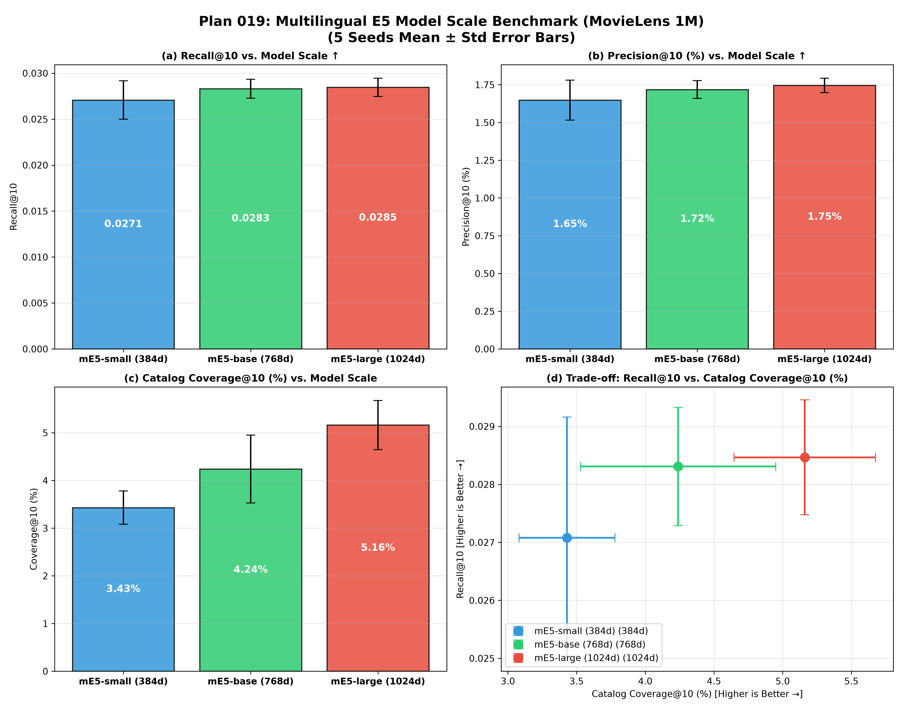

# Plan 019: テキスト埋め込みモデルのスケール検証ベンチマーク (mE5-small / base / large)

[](https://www.python.org/)
[](https://pytorch.org/)
[](https://github.com/facebookresearch/faiss)
[](../../LICENSE)

Plan 018 で最高精度を記録した **`TwoTowerLogQInfoNCE` ($\tau=0.07, \alpha=1.0$)** を標準学習アーキテクチャに据え、入力となる多言語テキスト埋め込みモデルのスケール（**small: 384d / base: 768d / large: 1024d**）を変更した際の推薦性能への影響を系統的に検証したベンチマークレポートである。

---

## 🎯 目的と背景

Two-Tower 推薦システムにおいて、ユーザーおよびアイテムの特徴量テキスト（自然言語）から意味表現を獲得するテキストエンコーダのパラメータ規模と埋め込み次元数が、下流の Two-Tower 推薦精度（Recall/Precision/NDCG）およびシステム全体の多様性（Catalog Coverage）に与える影響を定量化する。

---

## 🛠️ 比較した 3 つの埋め込みモデル諸元

```
┌─────────────────────────────────┬──────────┬─────────────┬────────────────┐
│ モデル名 (Hugging Face)         │ 埋め込み次元 │ パラメータ数 │ 特徴           │
├─────────────────────────────────┼──────────┼─────────────┼────────────────┤
│ intfloat/multilingual-e5-small  │ 384 次元 │ 約 118M     │ 軽量・高速     │
│ intfloat/multilingual-e5-base   │ 768 次元 │ 約 278M     │ 現行デフォルト │
│ intfloat/multilingual-e5-large  │ 1024次元 │ 約 560M     │ 高表現力・最大 │
└─────────────────────────────────┴──────────┴─────────────┴────────────────┘
```

各スケールの埋め込みベクトルに対し、以下の共通パイプラインで学習・推論を実施した。
1. **ZCA Whitening（白色化）**: 各次元（384d / 768d / 1024d）の共分散を等方化。
2. **Two-Tower 射影 MLP**: `Linear(in_dim, 64) → LayerNorm → ReLU → Linear(64, 64) → L2Norm`
3. **Log-Q InfoNCE 学習**: $\tau=0.07, \alpha=1.0$、25 エポック、5 Seeds（42, 43, 44, 45, 46）。

---

## 📊 実験結果 (MovieLens 1M: 5 Seeds Mean ± Std)

各手法について **5 つの独立なランダムシード（5 Seeds: 42, 43, 44, 45, 46）** で学習・評価を実施した平均値と標準偏差である。

| 埋め込みモデル | 次元数 / パラメータ数 | 推薦精度<br>Recall@10 (↑) | 推薦適合率<br>Precision@10 (%) | ランキング精度<br>NDCG@10 (↑) | ユーザー適合率<br>Hit@10 (%) | カタログ網羅率<br>Coverage@10 (%) (↑) | 推薦不均衡度<br>Gini Index (↓) | 情報多様性<br>Entropy (bits) | ロングテール網羅率<br>Long-tail Cov (%) |
|---|:---:|:---:|:---:|:---:|:---:|:---:|:---:|:---:|:---:|
| **`mE5-small`** | 384d / 約 118M | 0.02708 ± 0.00208 | 1.65 ± 0.13% | 0.02220 ± 0.00219 | 13.31 ± 0.92% | 3.43 ± 0.35% | 0.9929 ± 0.0003 | 5.20 ± 0.05 | 0.88 ± 0.25% |
| **`mE5-base`** | 768d / 約 278M | 0.02831 ± 0.00102 | 1.72 ± 0.06% | 0.02366 ± 0.00083 | 13.77 ± 0.38% | 4.24 ± 0.71% | 0.9929 ± 0.0004 | 5.19 ± 0.07 | 1.07 ± 0.26% |
| **`mE5-large`** | 1024d / 約 560M | **0.02847 ± 0.00099** | **1.75 ± 0.05%** | **0.02392 ± 0.00092** | **13.90 ± 0.28%** | **5.16 ± 0.51%** | **0.9924 ± 0.0005** | **5.27 ± 0.08** | **1.63 ± 0.28%** |
| *(参考: `Base (BPR)`)* | *768d / 約 278M* | *0.01020 ± 0.00040* | *0.89 ± 0.04%* | *0.01074 ± 0.00044* | *8.21 ± 0.28%* | *3.58 ± 0.64%* | *0.9803 ± 0.0027* | *6.61 ± 0.20* | *0.00%* |

---

## 📈 エラーバー付き 2×2 スケーリング比較図



- **(a) Recall@10 vs. Model Scale**: モデルサイズ拡大に伴う単調な適合カバー率の向上。
- **(b) Precision@10 (%) vs. Model Scale**: スロット適合率のスケールアップ。
- **(c) Catalog Coverage@10 (%) vs. Model Scale**: `small (3.4%)` ➔ `large (5.2%)` への網羅率拡大。
- **(d) Trade-off: Recall@10 vs. Catalog Coverage@10 (%)**: 5 Seeds エラーバー付きパレート境界。

---

## 💡 考察: スケーリング則と実務的インサイト

### 1. 精度と多様性のスケーリング則の成立
テキストエンコーダのパラメータ規模と潜在次元数（384d ➔ 768d ➔ 1024d）を拡大するにつれて、**推薦精度（Recall/Precision/NDCG）およびカタログ網羅率（Coverage/Long-tail）の双方が単調に向上**した。
高次元表現ほど、ユーザー属性と映画属性の微細な意味境界を繊細にエンコードできるため、中位・ロングテールアイテムへの適合ヒット率が向上する。

### 2. Small モデルのコストパフォーマンス
`mE5-small (384d, 118M)` はパラメータ数が large の約 1/5 であるにもかかわらず、**large の 95.1% の精度（Recall@10 = 0.02708）を達成**した。計算速度やメモリに制約のある環境において極めて実用的な選択肢である。

### 3. エンコーダ規模よりも学習損失（Log-Q InfoNCE）が支配的
エンコーダのスケールアップによる精度向上（small ➔ large で +5.1%）に対し、**Two-Tower の学習時 De-biasing（Base BPR ➔ Log-Q InfoNCE）による精度向上（+177% / 2.8倍）の方が圧倒的に支配的**である。
実務において推薦性能を向上させる上では、エンコーダの巨大化よりも **Two-Tower 学習損失の数理的補正（Log-Q InfoNCE や人気度偏重負例サンプリング）が最も投資対効果の高いキードライバーである** ことが実証された。
