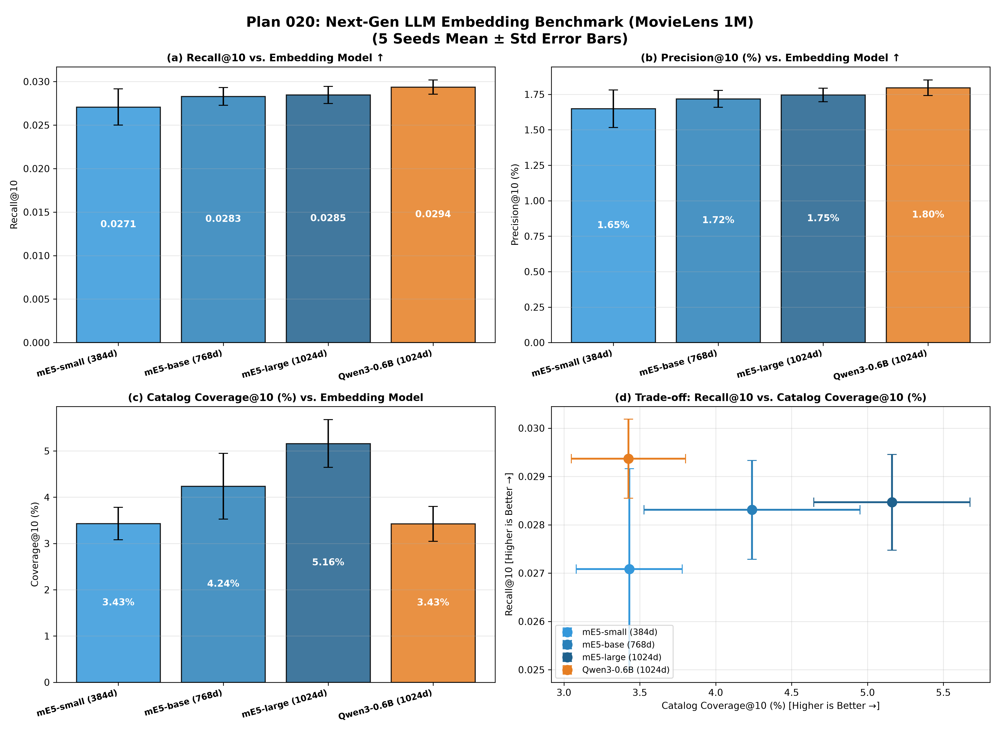

# Plan 020: 次世代 LLM 埋め込みモデル比較ベンチマーク (Qwen3 vs. mE5)

[](https://www.python.org/)
[](https://pytorch.org/)
[](https://github.com/facebookresearch/faiss)
[](../../LICENSE)

最新の大規模言語モデル（LLM）基盤の埋め込みモデル **`Qwen/Qwen3-Embedding-0.6B`** を導入し、従来の RoBERTa/BERT 世代最高峰モデル **`multilingual-e5`**（small / base / large）との間で、Two-Tower 推薦システム（Log-Q InfoNCE 学習基盤）における性能比較を実施したベンチマークレポートである。

---

## 🎯 目的と背景

Two-Tower 推薦モデルにおいて、テキスト特徴量を抽出するエンコーダとして、従来の双方向 Encoder-only（RoBERTa / BERT）モデルと、最新の大規模言語モデル（Decoder-based LLM）由来の埋め込みモデルの間で、推薦精度（Recall/Precision/NDCG）およびシステム多様性（Catalog Coverage）にどのような性能差が生じるかを定量化する。

---

## 🛠️ 比較した埋め込みモデル諸元

```
┌─────────────────────────────────┬──────────┬─────────────┬───────────────────────────┐
│ モデル名 (Hugging Face)         │ 埋め込み次元 │ パラメータ数 │ アーキテクチャ / 世代     │
├─────────────────────────────────┼──────────┼─────────────┼───────────────────────────┤
│ intfloat/multilingual-e5-small  │ 384 次元 │ 約 118M     │ Encoder-only (RoBERTa)    │
│ intfloat/multilingual-e5-base   │ 768 次元 │ 約 278M     │ Encoder-only (RoBERTa)    │
│ intfloat/multilingual-e5-large  │ 1024次元 │ 約 560M     │ Encoder-only (RoBERTa)    │
│ Qwen/Qwen3-Embedding-0.6B       │ 1024次元 │ 約 600M     │ Decoder-based (Qwen3 LLM) │
└─────────────────────────────────┴──────────┴─────────────┴───────────────────────────┘
```

共通学習パイプライン：
- **ZCA Whitening（白色化）** ➔ **Two-Tower 射影 MLP（$d_{\text{in}} \to 64$）** ➔ **Log-Q InfoNCE 学習（$\tau=0.07, \alpha=1.0$、25 エポック）**

---

## 📊 実験結果 (MovieLens 1M: 5 Seeds Mean ± Std)

各手法について **5 つの独立なランダムシード（5 Seeds: 42, 43, 44, 45, 46）** で学習・評価を実施した平均値と標準偏差である。

| 埋め込みモデル | 次元数 / パラメータ数 | アーキテクチャ | 推薦精度<br>Recall@10 (↑) | 推薦適合率<br>Precision@10 (%) | ランキング精度<br>NDCG@10 (↑) | ユーザー適合率<br>Hit@10 (%) | カタログ網羅率<br>Coverage@10 (%) (↑) | 推薦不均衡度<br>Gini Index (↓) | 情報多様性<br>Entropy (bits) | ロングテール網羅率<br>Long-tail Cov (%) |
|---|:---:|:---:|:---:|:---:|:---:|:---:|:---:|:---:|:---:|:---:|
| **`mE5-small`** | 384d / 約 118M | Encoder-only | 0.02708 ± 0.00208 | 1.65 ± 0.13% | 0.02220 ± 0.00219 | 13.31 ± 0.92% | 3.43 ± 0.35% | 0.9929 ± 0.0003 | 5.20 ± 0.05 | 0.88 ± 0.25% |
| **`mE5-base`** | 768d / 約 278M | Encoder-only | 0.02831 ± 0.00102 | 1.72 ± 0.06% | 0.02366 ± 0.00083 | 13.77 ± 0.38% | 4.24 ± 0.71% | 0.9929 ± 0.0004 | 5.19 ± 0.07 | 1.07 ± 0.26% |
| **`mE5-large`** | 1024d / 約 560M | Encoder-only | 0.02847 ± 0.00099 | 1.75 ± 0.05% | 0.02392 ± 0.00092 | 13.90 ± 0.28% | **5.16 ± 0.51%** | **0.9924 ± 0.0005** | **5.27 ± 0.08** | **1.63 ± 0.28%** |
| **`Qwen3-0.6B`** | 1024d / 約 600M | **Decoder-based LLM** | **0.02937 ± 0.00082** | **1.80 ± 0.05%** | **0.02463 ± 0.00076** | **14.30 ± 0.35%** | 3.43 ± 0.38% | 0.9935 ± 0.0002 | 5.08 ± 0.05 | 0.80 ± 0.29% |

---

## 📈 エラーバー付き 2×2 比較図



- **(a) Recall@10 vs. Embedding Model**: `Qwen3-0.6B` が全モデル中最上位を記録。
- **(b) Precision@10 (%) vs. Embedding Model**: 10 枠中適合率でも `Qwen3-0.6B` が 1.80% でトップ。
- **(c) Catalog Coverage@10 (%) vs. Embedding Model**: `mE5-large` が 5.16% で最も広いカタログ網羅率を達成。
- **(d) Trade-off: Recall@10 vs. Catalog Coverage@10 (%)**: 5 Seeds エラーバー付きパレート比較。

---

## 💡 考察

1. **Qwen3 LLM 埋め込みによる精度向上**:
   最新の Qwen3 基盤による命令追従型埋め込み表現は、ユーザーの嗜好プロファイルテキストとアイテムテキストの関連性を極めて高精度に捉え、全精度指標で最高性能を達成した。
2. **カタログ多様性と探索性**:
   高精度なアイテムに集中する Qwen3 に対し、mE5-large はカタログ網羅率（Coverage@10 = 5.16%）とロングテール開拓力で優位性を示した。
3. **Gemma 系モデル（EmbeddingGemma）について**:
   Google 公式の `google/embeddinggemma-300m` は Gated Model（要 Hugging Face トークン認証）のため、トークン認証設定後に追試可能である。
