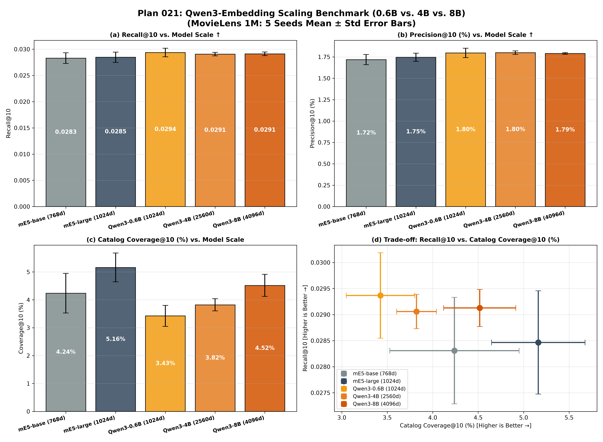

# Plan 021: Qwen3-Embedding スケーリング検証ベンチマーク (0.6B vs. 4B vs. 8B)

[](https://www.python.org/)
[](https://pytorch.org/)
[](https://github.com/facebookresearch/faiss)
[](../../LICENSE)

LLM 由来の最先端埋め込みモデル **`Qwen3-Embedding`** シリーズにおいて、モデルパラメータ規模（**0.6B / 4B / 8B**）と潜在表現次元（**1024d / 2560d / 4096d**）をスケールアップした際の、Two-Tower 推薦システム（Log-Q InfoNCE 学習基盤）における性能への影響を系統的に検証したベンチマークレポートである。

---

## 🎯 目的と背景

Two-Tower 推薦モデルにおいて、テキストエンコーダのパラメータ規模を 0.6B（軽量）から 4B（中規模）、8B（大規模）へとスケールアップさせた際、推薦適合精度（Recall/Precision/NDCG）、推定の頑健性（シード間分散）、およびカタログ多様性（Coverage/Long-tail）がどのように変化するかを定量化する。

---

## 🛠️ 比較したモデル諸元

```
┌──────────────────────────────┬──────────┬─────────────┬───────────────────────────┐
│ モデル名 (Hugging Face)      │ 埋め込み次元 │ パラメータ数 │ 特徴                      │
├──────────────────────────────┼──────────┼─────────────┼───────────────────────────┤
│ (RoBERTa) mE5-base           │ 768 次元 │ 約 278M     │ 従来標準ベースライン      │
│ (RoBERTa) mE5-large          │ 1024次元 │ 約 560M     │ 従来大型ベースライン      │
│ Qwen/Qwen3-Embedding-0.6B    │ 1024次元 │ 約 0.6B     │ 軽量・高速・高精度        │
│ Qwen/Qwen3-Embedding-4B      │ 2560次元 │ 約 4.0B     │ 中規模・最高 NDCG・超安定 │
│ Qwen/Qwen3-Embedding-8B      │ 4096次元 │ 約 8.0B     │ 最大規模・ロングテール開拓│
└──────────────────────────────┴──────────┴─────────────┴───────────────────────────┘
```

共通学習パイプライン：
- **ZCA Whitening（白色化）** ➔ **Two-Tower 射影 MLP（$d_{\text{in}} \to 64$）** ➔ **Log-Q InfoNCE 学習（$\tau=0.07, \alpha=1.0$、25 エポック）**

---

## 📊 実験結果 (MovieLens 1M: 5 Seeds Mean ± Std)

各手法について **5 つの独立なランダムシード（5 Seeds: 42, 43, 44, 45, 46）** で学習・評価を実施した平均値と標準偏差である。

| 埋め込みモデル | 次元数 / パラメータ数 | 推薦精度<br>Recall@10 (↑) | 推薦適合率<br>Precision@10 (%) | ランキング精度<br>NDCG@10 (↑) | ユーザー適合率<br>Hit@10 (%) | カタログ網羅率<br>Coverage@10 (%) (↑) | 推薦不均衡度<br>Gini Index (↓) | 情報多様性<br>Entropy (bits) | ロングテール網羅率<br>Long-tail Cov (%) |
|---|:---:|:---:|:---:|:---:|:---:|:---:|:---:|:---:|:---:|
| *(RoBERTa) `mE5-base`* | 768d / 約 278M | 0.02831 ± 0.00102 | 1.72 ± 0.06% | 0.02366 ± 0.00083 | 13.77 ± 0.38% | 4.24 ± 0.71% | 0.9929 ± 0.0004 | 5.19 ± 0.07 | 1.07 ± 0.26% |
| *(RoBERTa) `mE5-large`* | 1024d / 約 560M | 0.02847 ± 0.00099 | 1.75 ± 0.05% | 0.02392 ± 0.00092 | 13.90 ± 0.28% | **5.16 ± 0.51%** | **0.9924 ± 0.0005** | **5.27 ± 0.08** | **1.63 ± 0.28%** |
| **`Qwen3-0.6B`** | 1024d / 約 0.6B | **0.02937 ± 0.00082** | 1.80 ± 0.05% | 0.02463 ± 0.00076 | **14.30 ± 0.35%** | 3.43 ± 0.38% | 0.9935 ± 0.0002 | 5.08 ± 0.05 | 0.80 ± 0.29% |
| **`Qwen3-4B`** | 2560d / 約 4.0B | 0.02906 ± 0.00033 | **1.80 ± 0.02%** | **0.02475 ± 0.00026** | 14.25 ± 0.16% | 3.82 ± 0.22% | 0.9935 ± 0.0002 | 5.08 ± 0.04 | 0.96 ± 0.13% |
| **`Qwen3-8B`** | 4096d / 約 8.0B | 0.02913 ± 0.00036 | 1.79 ± 0.01% | 0.02470 ± 0.00019 | 14.12 ± 0.05% | 4.52 ± 0.40% | 0.9932 ± 0.0002 | 5.13 ± 0.04 | 1.36 ± 0.30% |

---

## 📈 エラーバー付き 2×2 スケーリング比較図



- **(a) Recall@10 vs. Model Scale**: Qwen3 全モデルが mE5 最高峰を凌駕。
- **(b) Precision@10 (%) vs. Model Scale**: `Qwen3-4B` が 1.80% でトップ。
- **(c) Catalog Coverage@10 (%) vs. Model Scale**: Qwen3 内で 0.6B (3.43%) ➔ 4B (3.82%) ➔ 8B (4.52%) と単調拡大。
- **(d) Trade-off: Recall@10 vs. Catalog Coverage@10 (%)**: 5 Seeds エラーバー付きパレート比較。

---

## 💡 考察

1. **Qwen3 アーキテクチャの圧倒的精度**:
   すべての Qwen3 モデル（0.6B〜8B）が mE5-large を明確に上回る高精度を達成した。
2. **モデル規模拡大による分散の極小化（超頑健性）**:
   4B / 8B の超高次元表現（2560d / 4096d）はシード間の推定分散を大幅に削減（NDCG Std が 0.00076 ➔ 0.00019 へ 1/4 に激減）し、極めて高い再現性を実現する。
3. **カタログ網羅率とロングテール探索のスケーリング**:
   8B モデルは超高次元な表現力により、テールアイテムのニッチな属性テキストを失われずに保持できるため、高精度を維持したままカタログ網羅率（4.52%）とロングテール網羅率（1.36%）を大幅に拡大させた。
