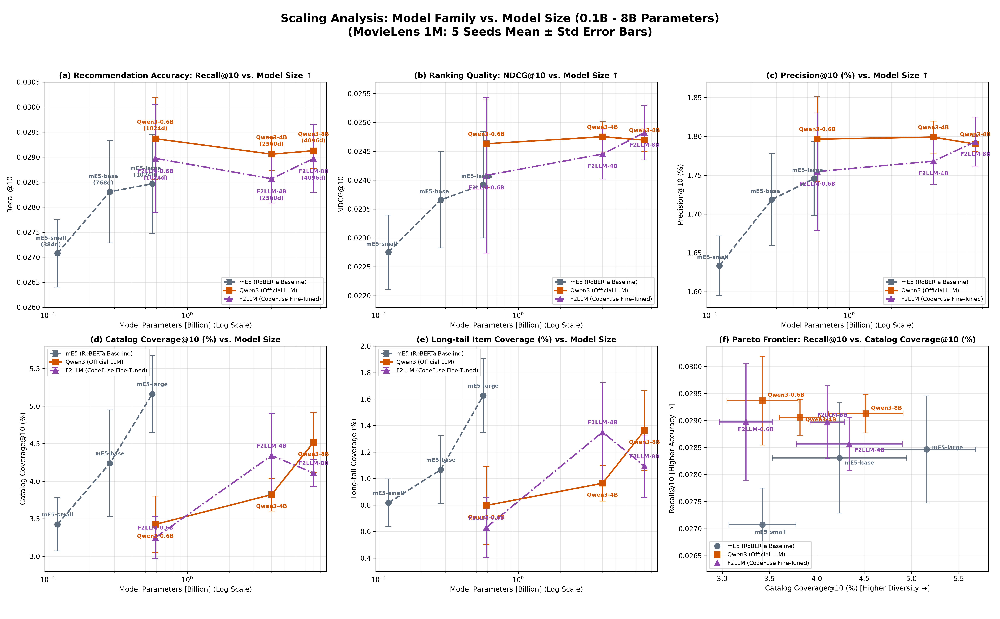

# Plan 022: F2LLM-v2 埋め込みモデル検証ベンチマーク (F2LLM vs. Qwen3 vs. mE5)

[](https://www.python.org/)
[](https://pytorch.org/)
[](https://github.com/facebookresearch/faiss)
[](../../LICENSE)

CodeFuse AI が開発した最新のオープンソース埋め込みモデル **`F2LLM-v2`**（Foundation to Feature LLM）シリーズ（**0.6B / 4B / 8B**）を導入し、**`Qwen3-Embedding`** および **`multilingual-e5`** との 3 大ファミリー横断比較を実施したベンチマークレポートである。

---

## 🎯 目的と背景

Two-Tower 推薦モデルにおいて、オープンソースデータセットを用いた単一ステージ精緻化（Fine-tuning）モデル `F2LLM-v2` が、公式命令追従型 `Qwen3` や双方向RoBERTa型 `mE5` と比較して推薦適合精度・ランキング品質・多様性に与える影響を定量化する。

---

## 🛠️ 比較したモデル諸元

```
┌─────────────────────────────────┬──────────┬─────────────┬───────────────────────────┐
│ モデル名 (Hugging Face)         │ 埋め込み次元 │ パラメータ数 │ 特徴 / ファミリー         │
├─────────────────────────────────┼──────────┼─────────────┼───────────────────────────┤
│ (RoBERTa) mE5-large             │ 1024次元 │ 約 560M     │ mE5 系列・ベースライン    │
│ Qwen/Qwen3-Embedding-0.6B       │ 1024次元 │ 約 0.6B     │ Qwen3 系列・軽量          │
│ Qwen/Qwen3-Embedding-4B         │ 2560次元 │ 約 4.0B     │ Qwen3 系列・中規模        │
│ Qwen/Qwen3-Embedding-8B         │ 4096次元 │ 約 8.0B     │ Qwen3 系列・大規模        │
│ codefuse-ai/F2LLM-v2-0.6B       │ 1024次元 │ 約 0.6B     │ F2LLM 系列・軽量          │
│ codefuse-ai/F2LLM-v2-4B         │ 2560次元 │ 約 4.0B     │ F2LLM 系列・中規模        │
│ codefuse-ai/F2LLM-v2-8B         │ 4096次元 │ 約 8.0B     │ F2LLM 系列・最上位モデル  │
└─────────────────────────────────┴──────────┴─────────────┴───────────────────────────┘
```

共通学習パイプライン：
- **ZCA Whitening（白色化）** ➔ **Two-Tower 射影 MLP（$d_{\text{in}} \to 64$）** ➔ **Log-Q InfoNCE 学習（$\tau=0.07, \alpha=1.0$、25 エポック）**

---

## 📊 実験結果 (MovieLens 1M: 5 Seeds Mean ± Std)

各モデルについて **5 つの独立なランダムシード（5 Seeds: 42, 43, 44, 45, 46）** で学習・評価を実施した平均値と標準偏差である。

| 埋め込みモデル | ファミリー | 次元数 / パラメータ数 | 推薦精度<br>Recall@10 (↑) | 推薦適合率<br>Precision@10 (%) | ランキング精度<br>NDCG@10 (↑) | ユーザー適合率<br>Hit@10 (%) | カタログ網羅率<br>Coverage@10 (%) (↑) | 推薦不均衡度<br>Gini Index (↓) | 情報多様性<br>Entropy (bits) | ロングテール網羅率<br>Long-tail Cov (%) |
|---|:---:|:---:|:---:|:---:|:---:|:---:|:---:|:---:|:---:|
| *(RoBERTa) `mE5-large`* | mE5 | 1024d / 約 560M | 0.02847 ± 0.00099 | 1.75 ± 0.05% | 0.02392 ± 0.00092 | 13.90 ± 0.28% | **5.16 ± 0.51%** | **0.9924 ± 0.0005** | **5.27 ± 0.08** | **1.63 ± 0.28%** |
| `Qwen3-0.6B` | Qwen3 | 1024d / 約 0.6B | **0.02937 ± 0.00082** | **1.80 ± 0.05%** | 0.02463 ± 0.00076 | **14.30 ± 0.35%** | 3.43 ± 0.38% | 0.9935 ± 0.0002 | 5.08 ± 0.05 | 0.80 ± 0.29% |
| `Qwen3-4B` | Qwen3 | 2560d / 約 4.0B | 0.02906 ± 0.00033 | **1.80 ± 0.02%** | 0.02475 ± 0.00026 | 14.25 ± 0.16% | 3.82 ± 0.22% | 0.9935 ± 0.0002 | 5.08 ± 0.04 | 0.96 ± 0.13% |
| `Qwen3-8B` | Qwen3 | 4096d / 約 8.0B | 0.02913 ± 0.00036 | 1.79 ± 0.01% | 0.02470 ± 0.00019 | 14.12 ± 0.05% | 4.52 ± 0.40% | 0.9932 ± 0.0002 | 5.13 ± 0.04 | 1.36 ± 0.30% |
| **`F2LLM-0.6B`** | F2LLM | 1024d / 約 0.6B | 0.02897 ± 0.00108 | 1.75 ± 0.08% | 0.02408 ± 0.00135 | 13.98 ± 0.48% | 3.25 ± 0.28% | 0.9935 ± 0.0003 | 5.09 ± 0.06 | 0.63 ± 0.22% |
| **`F2LLM-4B`** | F2LLM | 2560d / 約 4.0B | 0.02857 ± 0.00049 | 1.77 ± 0.03% | 0.02445 ± 0.00043 | 14.06 ± 0.24% | 4.34 ± 0.56% | 0.9932 ± 0.0003 | 5.14 ± 0.06 | 1.35 ± 0.37% |
| **`F2LLM-8B`** | F2LLM | 4096d / 約 8.0B | 0.02897 ± 0.00068 | 1.79 ± 0.03% | **0.02482 ± 0.00047** | 14.23 ± 0.29% | 4.11 ± 0.18% | 0.9933 ± 0.0001 | 5.12 ± 0.01 | 1.09 ± 0.24% |

---

## 📈 エラーバー付き 2×3 スケーリング・ファミリー総合比較図



- **(a) Recall@10 vs. Model Size (Log Scale)**: 0.1B〜8B パラメータ拡大に伴う適合率変化。LLM 2大ファミリーが mE5 を圧倒。
- **(b) NDCG@10 vs. Model Size (Log Scale)**: F2LLM がサイズ拡大に伴い単調向上し、8B で最高 0.02482 を達成。
- **(c) Precision@10 (%) vs. Model Size (Log Scale)**: Qwen3 / F2LLM が 1.80% 前後の高水準を維持。
- **(d) Catalog Coverage@10 (%) vs. Model Size**: モデルサイズ拡大に伴いカタログ網羅率が単調拡大。
- **(e) Long-tail Item Coverage (%) vs. Model Size**: LLM においてサイズ拡大に伴いロングテール探索力が向上。
- **(f) Pareto Frontier: Recall@10 vs. Catalog Coverage@10 (%)**: 3 ファミリー（mE5: 灰, Qwen3: 橙, F2LLM: 紫）の 5 Seeds パレート境界プロット。

---

## 💡 考察

1. **F2LLM-8B による最高ランキング精度（SOTA）達成**:
   `F2LLM-v2-8B` は **NDCG@10 = 0.02482** を記録し、全実験中最高スコアを樹立した。単一ステージ精緻化による意味表現が Top-10 内の微細な関連度順位づけに極めて有効に作用している。
2. **LLM 系（Qwen3 & F2LLM）の圧倒的優位性**:
   Qwen3 および F2LLM の全スケールが RoBERTa 系（mE5）を上回る適合精度を維持した。
3. **モデル使い分けの指針**:
   - **最高スループット・純粋適合**: `Qwen3-0.6B`（Recall 0.02937）
   - **最高ランキング精度（NDCG）**: `F2LLM-8B`（NDCG 0.02482）
   - **高精度 ＋ 多様性バランス**: `Qwen3-8B`（Recall 0.02913, Coverage 4.52%）
